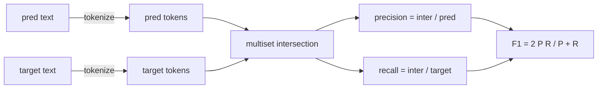
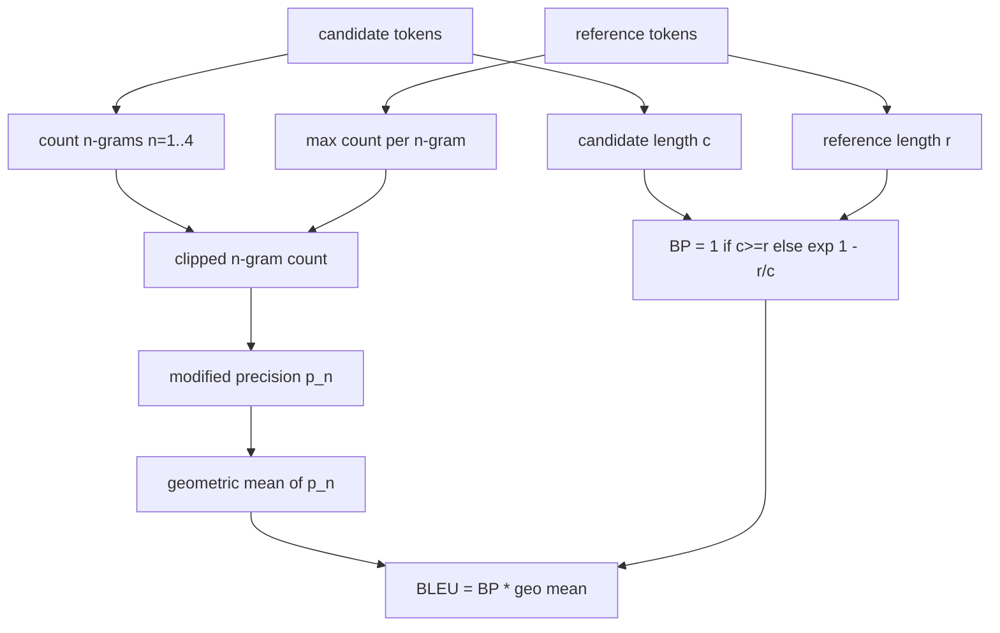

# Metricas clássicas

> BLEU, ROUGE-L, F1, correspondência exata, precisão. Cinco métricas que ainda representam a maioria dos números de avaliação LLM publicados. Implementar cada um a partir dos primeiros princípios para que você saiba o que o número significa.

**Type:** Build
**Languages:** Python
**Prerequisites:** Phase 19 Track B foundations, lesson 70
**Time:** ~90 min

## Objectivos de aprendizagem

- Implementar a correspondência exata, F1, e precisão ao nível de tokens com regras explícitas de tokenização.
- Implementar o BLEU-4 a partir do zero: precisão modificada n-gram, média geométrica sobre n é igual a 1 a 4, penalidade de brevidade.
- Implementar ROUGE-L utilizando a subsequência comum mais longa, com combinação F-beta de precisão e de recall.
- Enviar no campo metric_name da lição 70 para que o corredor permaneça metric-agnóstico.
- Aplicar o comportamento com vetores de referência extraídos de exemplos de trabalho, não de uma biblioteca de terceiros.

```figure
cd-bleu-overlap
```

## Por que reimplementar

Leirão artigos que relatam o BLEU 28.3 e outro que relata o BLEU 0.283. Encontrará pontuações ROUGE-L que diferem em dez pontos em duas bibliotecas porque uma truncada para minúscula e a outra não. A maneira mais rápida de parar de ficar confuso é escrever as métricas você mesmo, depois apontar para a linha onde o tokenizer é decidido e a linha onde o suavizamento é aplicado. Depois disso, comparar números entre documentos torna-se uma questão de ler a configuração métrica, não discutir sobre bibliotecas.

O STDlib mais Numpy é suficiente. O BLEU é contar e um pince. O ROUGE-L é programação dinâmica. F1 é uma interseção definida em tokens. A parte mais difícil é escolher um tokenizer e se comprometer com ele.

## Tokenização

O tokenizer é `re.findall(r"\w+", text.lower())`. letras minúsculas, corridas alfanuméricas, pontuação de queda. Cada métrica nesta aula usa este tokenizer exato. O corredor não tem escolha. Se você trocar tokenizers, você está executando um benchmark diferente.

```python
TOKEN_RE = re.compile(r"\w+", re.UNICODE)
def tokenize(text):
    return TOKEN_RE.findall(text.lower())
```

Esta é uma simplificação deliberada. Configurações de produção vão se preocupar com CJK, contrações e identificadores de código.

## - A correspondência exacta .

```python
def exact_match(pred, targets):
    return float(any(pred.strip() == t.strip() for t in targets))
```

Ele retorna 1,0 ou 0,0 por tarefa. O agregado sobre um conjunto de dados é a média. Este é o cavalo de trabalho para tarefas de aritmética, MCQ e classificação curta.

## Nível de tokens F1

Configure o multiset de token para previsão e meta. Precisão é a interseção do multiset dividida pelo multiset da previsão. Recall é a mesma interseção dividida pelo multiset do objetivo. F1 é a média harmônica. A implementação lida com os casos de previsão vazia e borda de meta vazia.



Para tarefas multi-alvo, escolhemos a melhor F1 sobre a lista de alvos.

## BLEU-4

A fórmula que usamos é a BLEU-4 de nível corpus com a penalidade de brevidade padrão e o suavização aditiva-um em contagens de n-gramas modificadas para que um único 4 gramas faltantes não empurre a pontuação para zero.

Para cada par de candidato-referência, contamos a precisão modificada n-gram para n igual a 1, 2, 3, 4. A precisão modificada faz com que o candidato n-gram conte pela contagem máxima desse n-gram em qualquer referência, de modo que um candidato não pode inflar repetindo uma frase. A média geométrica nas quatro precisões é envolvida pela penalidade de brevidade.



A regra de suavização é a chamada Lin e Och método 1: adicionar um ao numerador e denominador de cada n-gram precision antes de tomar o log.`log 0`quando uma referência não tem correspondente de 4 gramas e permanece próxima do valor não amenizado em candidatos longos.

## ROUGE-L

ROUGE-L compara a sucessão comum mais longa das sequências de token candidato e de referência. O LCS capta a ordem das palavras sem forçar a contiguiência, razão pela qual é a métrica de resumo padrão.`lcs / reference length`, precisão como `lcs / candidate length`, e combinar com F-beta onde beta é igual a um para a forma simétrica F1.

```python
def lcs_length(a, b):
    n, m = len(a), len(b)
    dp = numpy.zeros((n + 1, m + 1), dtype=int)
    for i in range(n):
        for j in range(m):
            if a[i] == b[j]:
                dp[i+1, j+1] = dp[i, j] + 1
            else:
                dp[i+1, j+1] = max(dp[i+1, j], dp[i, j+1])
    return int(dp[n, m])
```

A tabela numpy torna a implementação legível; listas puras Python funcionariam também. As tarefas que optam para ROUGE-L pagam o custo O(n) por tarefa. Para comprimentos de resumo típicos que permanecem abaixo de um milissegundo.

## Precision

Para tarefas de classificação de vários alvos, a precisão é reduzida a uma correspondência exata com um único alvo normalizado.`metric_name`sem fazer comparações dentro do corredor.

## Contrato de expedição

O ponto de entrada único é `score(metric_name, prediction, targets)`- Retorna uma flutuante .`[0, 1]`O corredor não se ramifica no nome métrico. Ele entrega a chamada e escreve o resultado. Esta é a superfície que a lição 75 pega na especificação da tarefa da lição 70.

```python
def score(metric_name, pred, targets):
    if metric_name == "exact_match":
        return exact_match(pred, targets)
    if metric_name == "f1":
        return max(f1_score(pred, t) for t in targets)
    if metric_name == "bleu_4":
        return max(bleu4(pred, t) for t in targets)
    if metric_name == "rouge_l":
        return max(rouge_l(pred, t) for t in targets)
    if metric_name == "accuracy":
        return accuracy(pred, targets)
    raise ValueError(f"unknown metric_name: {metric_name}")
```

`code_exec`É manuseado na lição 72 e colocado no despachador.

## O que esta lição não faz

Não chama um modelo, não normaliza gerações além do que as regras pós-processo da lição 70 já fizeram, não calcula intervalos de confiança, não faz BLEURT ou BERTScore (eles precisam de um modelo e vivem em uma lição diferente).

## Como ler o código

`main.py`define cada métrica como uma função livre mais o despachador.`_reference_examples`O demo executa o despachador em relação a oito exemplos e imprime pontuações por métrica.`code/tests/test_metrics.py`Pin os vetores de referência e sublinhar cada caso de borda (previsão vazia, referência vazia, nenhum token compartilhado, correspondência exata, recorte repetido de frases).

Leia `main.py`As funções são ordenadas por complexidade. exact_match e precisão são uma linha cada. F1 é de seis linhas. BLEU e ROUGE-L são as partes pesadas e incluem comentários detalhados sobre a regra de suavizamento e a recorrência do LCS.

## Vai mais longe

As métricas clássicas são necessárias, não suficientes. Eles recompensam a sobreposição de superfície e perdem significado. A solução é colocar métricas baseadas em modelos em cima (BLEURT, BERTScore, GEval) uma vez que você confia no piso clássico. Essa é uma lição posterior. Por agora: fazer esses cinco funcionar, pin-los com testes, e você tem uma pilha de métricas que é auditável, rápida e reprodutível.
