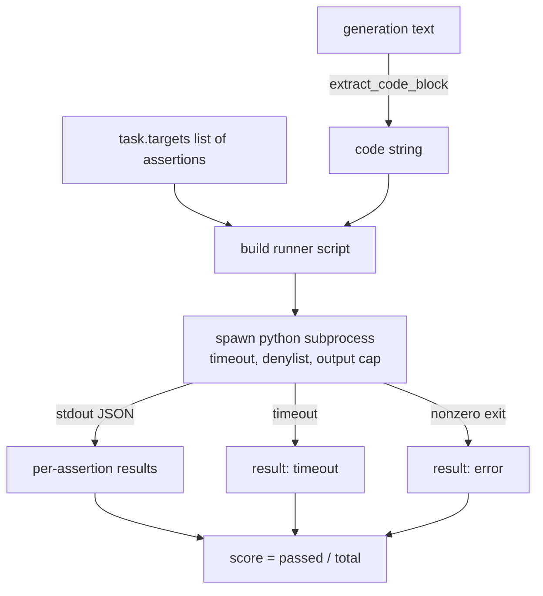
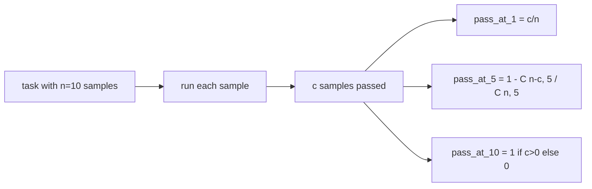

# Código Metrícula Executiva

> O código gerado é correto quando passa os testes. O harness de avaliação tem que extrair código, executá-lo sem quebrar o host, e contar as taxas de passagem honestamente. Esta lição construi essa superfície.

**Type:** Build
**Languages:** Python
**Prerequisites:** Phase 19 Track B foundations, lessons 70 and 71
**Time:** ~90 min

## Objectivos de aprendizagem

- Extrair um bloco de código de uma geração de forma livre de uma forma que corresponda à regra pós-processo da lição 70.
- Execute o código candidato em um subprocesso isolado com um cronograma de parede, limite de saída e um denilista de importação.
- Marcar uma tarefa como a fração das cadeias de afirmação fornecidas que passam contra o candidato.
- Compute pass-at-k para tarefas que mostram várias gerações de um modelo.
- Tratar caídas de caixa de areia, erros de sintaxe e temporadas como modos de falha de primeira classe com códigos de saída distintos que o corredor pode registrar.

```figure
sandbox-runner
```

## Por que um subprocesso isolado

Em linha .`exec`A situação de segurança e estabilidade é ameaçada.`while True: pass`Bloqueia a avaliação para sempre.`import shutil; shutil.rmtree('/')`A solução é gerar um novo intérprete Python por candidato, passar o código no stdin, escrever os resultados da afirmação para stdout e matar o processo se ele ultrapassar.

Os valores reais como HumanEval, MBPP, BigCodeBench e LiveCodeBench usam uma caixa de areia de subprocesso. Algumas camadas do Docker no topo. Nós paramos no subprocesso por uma razão: é portátil, é stdlib, e ele capta os modos de falha que importam para a avaliação educacional. As implementações de produção adicionam seccomp, isolamento de rede e um sistema de arquivos somente para leitura. A próxima lição sobre endurecimento de vidas fora desta faixa.

## A forma de uma tarefa de execução de código

A.`code_exec`tarefa carrega cadeias de afirmação em `targets`O corredor extrai um bloco de código cercado da geração, constrói um arame de teste em torno dele e executa o resultado.



A pontuação é uma fração de `[0, 1]`. Uma tarefa com três afirmações em que dois passes pontua 0,667. O corredor retorna a mesma forma, não importa o que falhe: os acidentes do subprocesso são mapeados para um código de erro normalizado, não um rastreamento Python que se espalha até o arnes.

## O Denylist

Antes de executar o código candidato, o roteiro executor reescreve as importações de módulos perigosos para um estúbo que eleva `ImportError("denied")`A lista é deliberadamente conservadora:`os.system`- Não .`subprocess`- Não .`socket`- Não .`requests`- Não .`urllib`- Não .`urllib.request`- Não .`urllib.error`- Não .`urllib.parse`- Não .`ctypes`- Não .`shutil`- Não .`http.client`- Não .`asyncio.subprocess`- Não .

Não pretendemos que seja à prova de balas. código adversário determinado pode escapar a qualquer caixa de areia em processo no Python. O denylist é um backstop. O tempo de saída do relógio de parede e o limite de saída são os controles de carga.

```python
DENIED = {
    "os.system": True,
    "subprocess": True,
    "socket": True,
    "shutil": True,
    "requests": True,
    "urllib": True,
    "ctypes": True,
}
```

Vamos encerrar o candidato pela prepêndio .`import sys`E um guarda que pega macacos .`os.system`A template completa está aqui.`main.py`- Não .

## Tempo de espera

Cada subprocesso recebe um orçamento padrão de três segundos.`subprocess.run(..., timeout=t)`Se o tempo de espera for, o corredor apanha.`TimeoutExpired`, mata o processo, e registra um`timeout`O resultado da tarefa é zero. O corredor segue em frente.

O timeout é configurável por tarefa até `task.metadata.timeout_s`Os testes unitários de longa duração podem exigir mais; o validador da lição 70 limita o valor a 30 segundos para manter a suíte limitada.

## Capítulo de saída

O subprocesso pode inundar o stdout, esgotando a memória do host. O corredor transmite o stdout para um tampão e mata a criança assim que o total de execução cruza 256 KB. O resultado é registrado como `exit_code = error`com a linha de detalhes `"output overflow"`Isto aparece na prática quando uma geração accidentalmente escreve um ciclo infinito que imprime.

## Passar-a-k

Pass-at-k é a estimadora imparcial usada pela HumanEval e amigos.`n`amostras independentes por tarefa e `c`de passagem, a probabilidade de uma amostra de tamanho `k`do `n`contém pelo menos uma solução de passagem:

```
pass_at_k(n, c, k) = 1 - C(n - c, k) / C(n, k)
```

Quando ?`n - c < k`O numerador é indefinido e o valor é `1`A implementação trata directamente do caso de borda.`pass_at_k(n, c, k)`para utilização pela camada de classificação na lição 74.



## Códigos de saída

O corredor retorna um dos cinco resultados por tarefa:

- `pass`Quando cada afirmação passar.
- `assertion_fail`Quando o código foi executado, mas pelo menos uma afirmação falhou.
- `syntax_error`quando o código não importou ou tinha um erro de sintaxe.
- `timeout`Quando o relógio da parede expirou.
- `error`para qualquer outro acidente, incluindo os acidentes de denilista e o desbordamento de saída (superfícies de desbordamento com detalhes `"output overflow"`)).

A pontuação ainda é uma fração. O código de saída é metadados. As lições a jusante podem decidir se contar um timeout como zero ou como dados faltantes.

## O que esta lição não faz

Não dá uma caixa de areia real. Não executa código não confiável da web aberta. Não lida com tarefas estatais como arquivo I / O ou chamadas de rede. Essas necessitam de um contêiner ou um microVM. O objetivo desta lição é o contrato: um subprocesso isolado, um denilista, um timeout, um limite de saída, um vocabulário limpo de código de saída e pass-at-k matemática.

## Como ler o código

`main.py`define`extract_code`- Não .`run_candidate`- Não .`score_code_exec`, e `pass_at_k`O script do subprocesso é construído como uma cadeia e passado como `-c`Os testes em`code/tests/test_exec.py`Exercer os quatro códigos de saída mais pass-at-k contra exemplos de trabalho extraídos do estilo HumanEval.

Leia `main.py`O modelo de corredor é a peça portadora. Olhe para o loop de afirmação até que você possa prever o envelope JSON que ele escreve de volta ao processo principal.

## Vai mais longe

Uma vez que a forma do subprocesso funciona, a próxima preocupação é a portabilidade. Diferentes versões do Python lidam com o SIGKILL de forma diferente no Windows. A solução mais limpa é colocar o corredor numa imagem do Docker. A próxima coisa depois disso é substituir as cadeias de afirmação com arquivos de teste de unidade reais para que o avaliar coincida com o que o CI de produção faz. Não chame de teste as cordas de afirmação nesse ponto; são testes de brinquedos e têm modos de falha de brinquedos.
