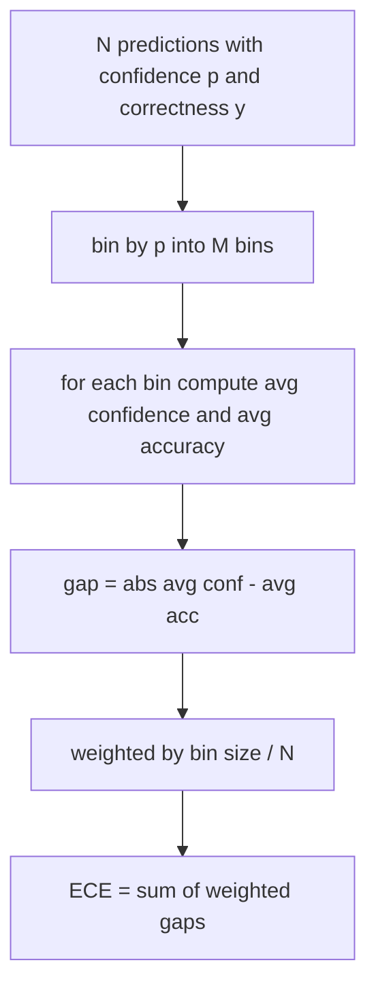
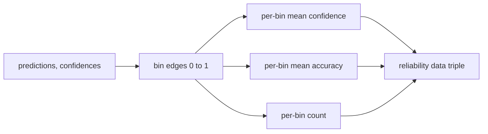

# Perplexidade e Calibração

> Se o seu modelo diz que tem 90% de confiança em mil respostas e tem seiscentas de certeza, não está bem calibrado. A calibração é metade da avaliação confiável. A outra metade é perplexidade, que diz se o modelo acha que o texto mantido é plausível.

**Type:** Build
**Languages:** Python
**Prerequisites:** Phase 19 Track B foundations, lessons 70 and 71
**Time:** ~90 min

## Objectivos de aprendizagem

- Calcule a perplexidade de nível de token em um corpus de token de probabilidades de log negativo fornecidas pelo adaptador do modelo.
- Calcular o erro de calibração esperado (ECE) de um classificador ou de uma avaliação de escolha múltipla a partir de probabilidades previstas.
- Calcule a pontuação Brier (erro quadrado médio contra o indicador de correcção) e explique quando ela faz o que a ECE não faz.
- Construir os dados do diagrama de confiabilidade necessários para traçar uma curva de confiança versus precisão.
- Enfiem os três no cinto de avaliação para que o corredor possa ligar .`perplexity`- Não .`ece`, e `brier`Números para um relatório modelo.

```figure
cd-reliability-diagram
```

## O que a perplexidade diz-te

Perplexidade é a probabilidade média negativa exponencial por token. Mais baixo é melhor. Uma perplexidade de um significa que o modelo atribui probabilidade de um a cada token real. Uma perplexidade do tamanho do vocabulário significa que o modelo é uniforme e nada aprendido. Os números reais caem entre os dois: um modelo base forte de 2026 no WikiText-103 fica em torno de oito a doze. Um mau no mesmo texto fica a 50 mais.

O arnes não calcula as probabilidades de log em si. Aquelas vêm do adaptador do modelo. Os agregados do arnes: ele toma uma lista de probabilidades de log por token, uma lista de contagens de token por sequência e retorna a perplexidade do corpus.

```python
def perplexity(neg_log_probs, token_counts):
    total_nll = sum(neg_log_probs)
    total_tokens = sum(token_counts)
    return math.exp(total_nll / total_tokens)
```

A implementação lida com casos de borda de tokens zero e afirma que as probabilidades negativas de log são não negativas.`log p`Em vez de`-log p`A função pega isso como uma violação de contrato.

## Que medidas tomam a Comissão Europeia

Os erros de calibração esperados agrupam as previsões por sua confiança num número fixo de recipientes, e depois medem a diferença média entre a confiança e a precisão entre recipientes, ponderada pelo tamanho do recipiente.



A formulação padrão usa dez recipientes de largura igual em `[0, 1]`A implementação suporta qualquer contagem de números inteiros positivos.`bins`Parâmetro para que o corredor possa escolher entre a convenção de publicação (10) e a convenção de comparação (15).

O ECE é parcialmente calculado pelo número de recipientes e tamanho da amostra. Com dez recipientes e cem previsões, você não pode distinguir 0,02 ECE do ruído aleatório. A implementação retorna o número de recipientes povoados junto com o ECE para que o corredor possa recusar relatar um único número em poucas amostras.

## O que Brier faz que a ECE não

O ECE só se importa com as lacunas médias. Um modelo que é demasiado confiante em metade dos contentores e pouco confiante na outra metade pode ter um baixo ECE enquanto está mal calibrado localmente.

Para resultados binários, Brier é `mean((p_i - y_i)^2)`O corredor informa o escalar mas registra a decomposição para o painel.

```python
def brier(p, y):
    return float(np.mean((p - y) ** 2))
```

## Dados do diagrama de confiabilidade

Um diagrama de confiabilidade previu a confiança contra a precisão empírica em cada bin. A diagonal é uma calibração perfeita. A função retorna três matrizes: confiança média por bin, precisão média por bin e contagem por bin. O código de traçamento vive para baixo; esta lição termina na forma de dados.



O tuple retornado é o que uma camada de chamada precisa para desenhar o gráfico ou calcular uma variante ECE personalizada (ECE adaptativa, varredura ECE, etc.).

## Fontes de confiança

O arame não assume que a confiança venha de softmax.`[0, 1]`Para tarefas de múltipla escolha, a confiança natural é `softmax over option log-likelihoods`Para o texto livre a confiança natural é a probabilidade auto-relatada do modelo ou o exponencial da probabilidade média de registro.

## Casas de borda

- Todas as previsões erradas: ECE é a confiança média, Brier é alta, perplexidade é o que o modelo pensa do texto.
- Todas as previsões corretas com alta confiança: ECE perto de zero, Brier perto de zero.
- Preditor perfeitamente incerto em p = 0,5: ECE é 0,5 menos precisão, Brier é 0,25 menos um termo de correção.
- Entrada em branco: ECE, Brier e retorno de confiabilidade `0.0`(ou matrizes com zero) Retorna perplexidade `NaN`Para o caso de tokens zero, nenhum desses caminhos emite um aviso; o corredor inspeciona os valores e decide se deve relatar ou saltar.

Um modelo real com um ponto de referência real não vai bater-lhes, mas um adaptador de buggy ou uma pequena amostra vai, e o corredor não deve acertar.

## Envio

A calibração não é uma métrica por tarefa como a F1. É um relatório por modelo.`(confidence, correct)`O sistema de avaliação de dados de composição de dados de composição de dados de composição de dados de composição de dados de composição de dados de composição de dados de composição de dados de composição de dados de composição de dados de composição de dados de composição de dados de composição de dados de composição de dados de composição de dados de composição de dados de composição de dados de composição de composição de dados de composição de composição de dados de composição de composição de composição de composição de composição de composição de composição de composição de composição de composição de composição de composição de composição de composição de composição de composição de composição de composição de composição de composição de composição de composição de composição de composição de composição de composição de composição de composição de composição de composição de composição de composição de composição de composição de composição de composição de composição de composição de composição de composição de composição de composição de composição de composição de composição de composição de composição de composição de composição de composição de composição de composição de composição de composição de composição de composição de composição de composição de composição de composição de composição de composição de composição de composição de composição de composição de composição de composição de composição de composição de composição de composição de composição de composição de composição de composição de composição de composição de composição de composição de composição de composição de composição de composição de composição de composição de composição de composição de composição de composição de composição de composição de composição de composição de composição de composição de composição de composição de composição de composição de composição de composição de composição de composição de composição de composição de composição de composição de composição de composição de composição de composição de composição de composição de composição de composição de composição de composição de composição de composição de composição de composição de composição de composição de composição de composição de composição de composição de composição de composição de composição de composição de composição de composição de composição de composição

A interface é:

```python
report = CalibrationReport.from_predictions(confidences, correct)
report.ece          # float
report.brier        # float
report.reliability  # tuple of three numpy arrays
report.populated_bins  # int
```

`PerplexityResult.from_token_nll(neg_log_probs, token_counts)`Retorna a perplexidade e a probabilidade média negativa de registro por token.

## O que esta lição não faz

Não chama um modelo. Não implementa softmax. Não estima a confiança dos tokens de saída; esse é o trabalho do adaptador. Não faz escala de temperatura ou escala de Platt; essas são correções pós-hoc que vivem em uma lição diferente.

## Como ler o código

`main.py`define`perplexity`- Não .`expected_calibration_error`- Não .`brier_score`- Não .`reliability_diagram`, e o `CalibrationReport`- Não .`PerplexityResult`A demonstração é baseada em previsões sintéticas onde a verdade básica é conhecida: um modelo bem calibrado, um modelo superconfiante e um pouco confiante.`code/tests/test_calibration.py`Pins cada caixa de borda mais valores de referência para os preditores sintéticos.

Leia `main.py`A ordem da função vai escalar para vetor para relatar. cada função tem uma curta docstring com a matemática e o contrato.

## Vai mais longe

A calibração é o eixo mais ignorado na avaliação publicada. A maioria dos rankings relata um único número de precisão e diz que está feito. Um modelo que ganha com a precisão e perde com a Brier é uma implantação de produção pior do que um modelo que obtém alguns pontos mais baixos na precisão, mas relata com confiança a sua incerteza. Depois de ter instalado o sistema de encanamento, adicione uma escala de temperatura a uma fatia de validação prolongada, recompute o ECE e observe o abismo diminuir. É uma lição separada, mas o piso vive aqui.
