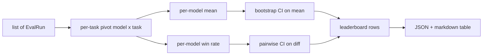
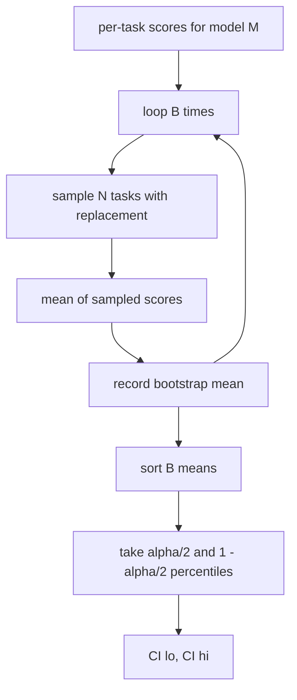

# Agregação do quadro de desempenho

> As pontuações por tarefa são fáceis. Os rankings por modelo em tarefas heterogêneas são mais difíceis. A importância estatística em um ranking de mil previsões é a parte que todos saltam. Esta lição não a salta.

**Type:** Build
**Languages:** Python
**Prerequisites:** Phase 19 Track B foundations, lessons 70, 71, 73
**Time:** ~90 min

## Objectivos de aprendizagem

- Agrega as pontuações por tarefa em vários modelos e múltiplas tarefas em uma linha ordenada por modelo.
- Normalizar as pontuações heterogéneas para que as taxas de aprovação e os valores BLEU não influenciem o agregado.
- Classifique os modelos por média e por taxa de ganho, e explique quando cada um é o resumo certo.
- Calcule intervalos de confiança de bootstrap com base na média de pontuação por modelo e nas diferenças em pares.
- Exporte o ranking como um relatório JSON e como uma tabela de marcação o corredor na lição 75 pode colar em um comentário CI.

```figure
ci-leaderboard-ci
```

## Forma da entrada

O agregador consome uma lista de `EvalRun`Registros:

```python
@dataclass
class EvalRun:
    model_id: str
    task_id: str
    metric_name: str
    score: float          # in [0, 1]
    category: str
```

O corredor da lição 75 emite um recorde por .`(model, task)`O agregador não se importa como a pontuação foi produzida, espera que a normalização já tenha acontecido: cada pontuação está em`[0, 1]`- Não .

## A saída

São três as mesas:



A linha do ranking contém: `model_id`- Não .`mean_score`- Não .`mean_ci_lo`- Não .`mean_ci_hi`- Não .`win_rate`- Não .`tasks_completed`, e opcional `categories`Mapa para média por categoria.

## Normalização

Se uma tarefa conseguir em `[0, 1]`E outro em`[0, 100]`O agregador valida que cada pontuação de entrada está em`[0, 1]`A correção vive para cima do fluxo: a métrica deve já retornar uma fração.

## Mediana e taxa de ganhos

Os dois esquemas de classificação servem objetivos diferentes.

A pontuação média é a média das pontuações por tarefa de um modelo. É o relatório de números de cabeçalhos dos rankings. É sensível a valores fora do plano e a desequilíbrios de tarefas.

A taxa de vitória conta a frequência com que um modelo vence todos os outros modelos na mesma tarefa. Para cada tarefa, o modelo com a maior pontuação ganha (cortes divididos). A taxa de vitória é igual a vitórias divididas pelo número de tarefas onde o modelo tem uma pontuação. É menos sensível aos valores e às diferenças de escala, mas perde informações.

```python
def win_rate(model_id, runs_by_task, all_models):
    wins, total = 0, 0
    for task_id, runs in runs_by_task.items():
        scores = {r.model_id: r.score for r in runs if r.model_id in all_models}
        if model_id not in scores:
            continue
        total += 1
        best = max(scores.values())
        if scores[model_id] >= best:
            wins += 1
    return wins / total if total else 0.0
```

O arnes relata ambos. O corredor na lição 75 ocupa o lugar de média por padrão; a coluna de marcação para a taxa de vitória está ali mesmo, caso o usuário prefira.

## Intervalos de confiança de bootstrap

Os métodos por modelo apresentam um intervalo de confiança estimado por bootstrap resampling sobre tarefas.`B`vezes, e tomar o intervalo percentil no nível `alpha`- Não .



Para comparações em pares, nós arrancamos a diferença por tarefa `score_A - score_B`O usuário lê se o intervalo exclui zero. Se isso acontecer, a diferença é significativa no nível alfa. Se não acontecer, o ranking trata os modelos como empatados.

Os auxiliares de baixo nível (`bootstrap_mean_ci`- Não .`bootstrap_pairwise_diff`) de incumprimento `B=1000`• os agregadores públicos (`aggregate`- Não .`pairwise_diffs`) de incumprimento `b=500`A lição mantém o bootstrap puro, sem esquiva.

## Categoria

Se`EvalRun.category`Quando a posição é definida, o agregador também relata a média por categoria.`math`- Não .`reasoning`- Não .`code`- Não .`safety`Permite ao corredor identificar se um modelo é bom em geral mas fraco em código, que é informação que o título significa oculta.

## Rendering de marcação

O quadro de classificação é apresentado como um quadro de redução:

```text
| Rank | Model | Mean | 95% CI | Win rate | Tasks |
|------|-------|------|--------|----------|-------|
| 1    | gpt   | 0.78 | 0.74-0.82 | 0.62 | 50 |
| 2    | claude| 0.75 | 0.71-0.79 | 0.34 | 50 |
| 3    | random| 0.10 | 0.07-0.13 | 0.04 | 50 |
```

A tabela é ordenada por pontuação média. O CI é apresentado a dois decimais.

## O que esta lição não faz

Não executa modelos. Não chama a camada métrica. Não implementa ECE adaptativa ou outras variantes de calibração; essas são lições 73. Não implementa pesagem de tarefas. Cada tarefa conta igual aqui.`weight`Mas não o considere no agregador. Adicione peso numa lição de acompanhamento se precisar.

## Como ler o código

`main.py`define`EvalRun`- Não .`LeaderboardRow`- Não .`aggregate`- Não .`bootstrap_mean_ci`- Não .`bootstrap_pairwise_diff`, e `render_markdown`A demonstração constrói um conjunto sintético de três modelos e doze tarefas, agrega e imprime o quadro de classificação mais a tabela de diferença em pares.`code/tests/test_leaderboard.py`Pin o bootstrap, a renderização de marcação, os casos de vantagem da taxa de ganho e o comportamento de entrada vazia.

Leia `main.py`A forma de dados (EvalRun, LeaderboardRow) vem em primeiro lugar, o agregador depois, o bootstrap terceiro, a renderização último. Cada função tem um contrato focado.

## Vai mais longe

O próximo passo natural é significar tarefas em pares em vez de arranque sem pares. Se o modelo A e o modelo B executaram as mesmas cem tarefas, o teste apropriado é o arranque em par na diferença de tarefa por tarefa, que implementamos. Além disso, você quer um arranque hierárquico que respeite as famílias de tarefas (problemas matemáticas não são independentes uns dos outros; um padrão de erro aritmético afeta dez deles). Isso é um seguimento. O objetivo desta lição é conseguir o piso certo para que o avaliador informe um número que você possa defender.
