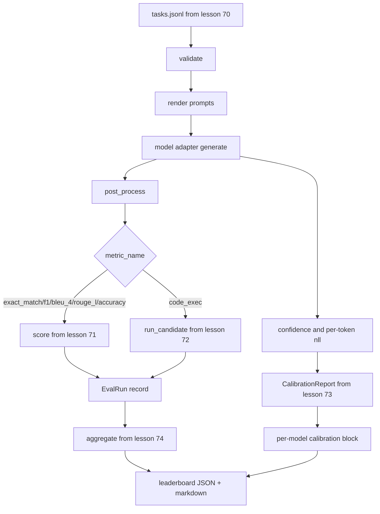

# Corredor de Eval de ponta a ponta

> Cinco lições de canalização, uma lição para pegá-las. O corredor lê a especificação da tarefa da lição 70, chama um modelo através de um adaptador, marca com lições 71 e 72, anexa o relatório de calibração da lição 73, e emite o quadro de classificação da lição 74.

**Type:** Build
**Languages:** Python
**Prerequisites:** Phase 19 Track B foundations, lessons 70 through 74
**Time:** ~90 min

## Objectivos de aprendizagem

- Define um`ModelAdapter`Interface que qualquer modelo (simulado, local, API) pode satisfazer com uma pequena superfície de método.
- Execute o eval em um arquivo JSONL fixo com execução paralela de tarefas em um pool de trabalhadores.
- Compõem a camada métrica (exact_match, F1, BLEU-4, ROUGE-L, code_exec) com a camada de calibração em uma passagem.
- Emissão por modelo `EvalRun`registos e os enfiam diretamente no agregador de classificação.
- Exporte um relatório JSON e uma tabela de marcação; auto-terminar com saída zero em uma execução limpa, não zero em validação ou falha de tempo de execução.

```figure
eval-grid
```

## O oleoduto



O corredor é o ponto de integração. Cada lição 70 a 74 possui um módulo que o corredor compõe. O corredor não duplica nenhuma lógica desses módulos: ele os importa.

## A interface do adaptador

O adaptador é a costura entre o corredor e qualquer modelo.

```python
class ModelAdapter:
    model_id: str

    def generate(self, prompt: str, task: TaskSpec) -> Generation: ...
```

`Generation`é uma classe de dados com:

- `text`: saída em forma livre do modelo
- `confidence`: um flutuante em`[0, 1]`que representa a probabilidade de resposta do modelo auto-relatada
- `token_nll`: soma opcional de probabilidades negativas de registro sobre os tokens gerados
- `token_count`: número opcional de tokens gerados

Os adaptadores de simulação no corredor fornecem três sabores: `RuleBasedAdapter`(determinista, quase perfeito),`NoisyAdapter`(excessivamente confiante, muitas vezes errada), e`BiasedAdapter`A demonstração é feita em todas as três partes da lição 70.

## Execução paralela

O corredor usa`concurrent.futures.ThreadPoolExecutor`Para executar tarefas em paralelo por modelo. A contagem de trabalhador é padrão para o menor de oito e a contagem de tarefas. Os fios são suficientes porque o gargalo de engarrafamento para chamadas de modelo real é a I/O da rede. O caminho de code-exec gera seu próprio subprocesso dentro da tarefa e o executor só agenda a espera.

Para testes deterministas, o corredor expõe `run_eval(adapters, tasks, parallel=False)`Para que os testes possam determinar a ordem de execução.

## O ciclo de pontuação de passagem única

Para cada tarefa:

1. Retorna o aviso (prefixo de poucas fotos mais o corpo do aviso).
2. Liga ao adaptador e programa a chamada.
3. Pós-processo da geração de acordo com a regra da tarefa.
4. Enviar para a camada métrica.
5. Construir um`EvalRun`registar com a pontuação e os metadados métricos.
6. Aplicar o`(confidence, correct)`Parar com o tampão de calibração.

O `correct`O sinal é`score >= 1.0`para métricas de estilo exact_match (`exact_match`- Não .`accuracy`- Não .`code_exec`) e `score >= 0.5`O limite de desempenho é de`_correct_from_score`E o corredor não expõe um prejuízo público.

## Agrupamento

Depois de cada tarefa ter um resultado, o corredor chama.`aggregate`E ...`pairwise_diffs`da lição 74 e `CalibrationReport.from_predictions`A saída é um único envelope JSON:

```json
{
  "leaderboard": [...],
  "pairwise": [...],
  "calibration": {
    "model_id_a": {"ece": 0.04, "brier": 0.10, "populated_bins": 8, ...},
    ...
  },
  "summary": {
    "tasks": 10,
    "models": 3,
    "wall_seconds": 1.2
  }
}
```

O corredor também escreve uma tabela de marcação para o stdout para que o usuário possa colar o resultado em uma revisão de relações públicas.

## Demo autotermino

A demonstração executa três adaptadores simulados nas dez tarefas de fixação da lição 70. O tempo de parede deve ficar abaixo de dez segundos. O código de saída é zero em uma execução limpa.

Os critérios de gestão limpa são:

- Cada tarefa validada sob a lição 70.
- Cada tarefa foi marcada nas lições 71 e 72.
- O relatório de calibração agregado na lição 73 sem erros.
- O ranking classifica o adaptador baseado em regras estritamente acima do adaptador aleatório.

Se qualquer um desses falhar, o corredor sai de não zero com um erro estruturado no envelope JSON.

## O que esta lição não faz

Ele não chama um modelo real. Ele não implementa um fluxo de chave API ou o tratamento de limite de taxa. Ele não implementa streaming ou geração parcial; o adaptador retorna uma geração por chamada. Ele não faz retries ou cache. Essas preocupações vivem na camada do adaptador; o executor é métrico-agnóstico e provedor-agnóstico.

## Como ler o código

`main.py`A integração é a importância dos outros cinco módulos de lições através de um pequeno`_load_sibling`As classes de dados são as que são utilizadas para resolver os problemas.`Generation`- Não .`EvalReport`, e `ModelAdapter`Os adaptadores falsos estão no final do ficheiro.

Leia `main.py`A Comissão não pode fazer isso.`run_eval`, então`_score_one`A demonstração no final é o ponto de entrada.

Os testes em `code/tests/test_runner.py`Pin a interface do adaptador, o loop de passagem única, a equivalência paralela versus sequencial, o buffer de calibração e a forma do envelope JSON.

## Vai mais longe

Este corredor é o piso. Um sistema de avaliação de produção adiciona: um cache de resultados teclado por `(task_id, model_id, model_version)`O sistema de transferência de dados é um sistema de transferência de dados, um livro de custos que rastreia dólares e tokens por rodada, uma camada de retest que se baseia em limites de taxa, uma política de amostragem para tarefas pass-at-k e um formato de saída de streaming para longos suítes.

Adicione um adaptador para um provedor real depois de ter as simulações funcionando. Escolha um com um nível livre, escreva trinta linhas de cola, veja a placa de classificação acender. Adicione o segundo provedor e deixe o arame fazer o trabalho.
