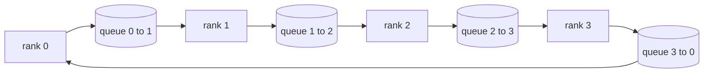

# Operações coletivas a partir do zero

> As quatro operações coletivas que mantêm a formação distribuída juntas são todosreduce, broadcast, allgather e reduce_scatter.`multiprocessing.Queue`A rede de transporte de água, verificá-las contra uma implementação de referência e o resto da pista torna-se canalização.

**Type:** Build
**Languages:** Python
**Prerequisites:** Phase 19 Track C lessons 42-49
**Time:** ~90 min

## Objetivos de aprendizagem

- Implementar anel allreduce em duas passagens (reduce-dispersor e depois allgather) e provar que o volume de comunicação por rank é 2 ((N-1) / N bytes por elemento.
- Construir transmissão, todos reunidos, e reduzir_scatter em cima de ponto a ponto envia sobre `multiprocessing.Queue`- Não .
- Verifique cada primitivo contra um`torch.distributed`Referência de luz para a mesma entrada.
- Defender a escolha de anel versus árvore em forma de aglomerado, piso de latência e teto de largura de banda.

## O problema

Um total-reduzido ingênuo sobre N filas envia N vezes o tensor para uma raiz e transmite N vezes de volta. A largura de banda se escala como O ((N) por classificação, a raiz se torna um gargalo de engarrafamento, e o piso do relógio de parede é o link mais lento vezes N. Ring allreduce que aplanta em 2 ((N-1) pedaços de tamanho T/N, para que os bytes por rank caem para 2T ((N-1)/N independentemente do tamanho do cluster. Árvore allreduce ganha em pequenos N e ligações de alta latência porque a profundidade é log2(N) saltos em vez de 2(N-1). Escolha a topologia errada para a forma do cluster e a GPU mais lenta dita o tempo de passagem.

Cada estrutura de treinamento distribuída que você vai ler esta faixa depende destes quatro primitivos. A PyTorch DDP sincroniza gradientes com um allreduce por balde de parâmetros. A ZeRO reduz o estado de otimização através da redução_dispersão e transmite os parâmetros atualizados pela allgather. O FSDP transforma o avanço completo em allgather + reduce_scatter. Necessidades paralelas de transmissão de canais para ativas em grupos de estágios. Se não conseguir implementar os quatro coletivos, não pode argumentar sobre por que o treinamento está parado, por que a desatividade de gradientes aparece na posição 3, ou por que a bolha de pipeline duplica-se quando trocamos topologias.

## O conceito



### Anel todo redução em duas passagens

Divida o tensor em N partes iguais indexadas 0..N-1. Cada grau possui um índice de partes igual à sua categoria. Passagem 1, redução de dispersação, passa N-1. No passo s, o rank r envia o chunk (r - s) mod N para o rank (r + 1) mod N e recebe o chunk (r - s - 1) mod N do rank (r - 1) mod N, acumulando o chunk recebido em sua cópia local. Após os passos N-1, a classificação r possui a soma completa para a peça r. Passar 2, todos juntos, executar outro N-1 passos e girar os pedaços acabados ao redor do anel até cada linha tem a soma completa para cada pedaço.

| Primitive | Per-rank bytes | Steps | When to use |
|-----------|---------------|-------|-------------|
| Ring allreduce | 2T(N-1)/N | 2(N-1) | Large T, fat-pipe homogeneous cluster |
| Tree allreduce | T log2(N) | 2 log2(N) | Small T or high-latency links |
| Broadcast | T | log2(N) tree | Parameter init, scalar config |
| Allgather | T(N-1)/N | N-1 | Sharded forward, ZeRO unshard |
| Reduce_scatter | T(N-1)/N | N-1 | ZeRO gradient sharding |

### Messa de fila como substituto para NCCL

O NCCL é executado em PCIe e NVLink com reduções descarregadas de hardware.`multiprocessing.Queue`A redução ocorre no espaço do usuário, então você paga Python, mas o padrão de fio é idêntico ao NCCL ring allreduce.

### Verificar contra o gloo

Cada primitivo chega com um teste unitário que compara a sua produção com `torch.distributed`O teste é iniciado com o backend gloo no mesmo tensor em todo o mesmo tamanho mundial. Se o seu anel allreduce se desviar do gloo em mais de float32 epsilon, o teste falha.

```figure
ci-ring-allreduce
```

## Construí-lo

`code/main.py`Implementos:

- `Mesh`classe que liga N `multiprocessing.Queue`Inserções num anel e exposições `send(dst, tensor)`E ...`recv(src)`Por grau.
- `ring_allreduce(mesh, rank, world_size, tensor)`executando o algoritmo de dois passos.
- `broadcast(mesh, rank, world_size, tensor, src)`sobre uma árvore logaritmica.
- `allgather(mesh, rank, world_size, tensor)`utilizando rotações N-1.
- `reduce_scatter(mesh, rank, world_size, tensor)`como a primeira metade de todo redução.
- `_gloo_reference(op, world_size, tensor)`que corre a mesma entrada através `torch.distributed`com gloo para comparação em byte-equivalente.

- É o que é ?

```bash
python3 code/main.py
```

Output: Tabela de verificação primitiva comparando as saídas de rede de fila e de luz, seguida de um contador de bytes por rank que comprova a escalação 2T(N-1)/N.

## Padrões de produção em silêncio

Três padrões endurecem os primitivos o suficiente para enviar.

**Bucket gradients before allreduce.**Um modelo de parâmetro 1B tem dezenas de milhares de tensores de gradiente. Um allreduce por tensor paga o piso de latência N vezes. DDP embutidos gradientes em ~ 25 MB pedaços e embutidos um allreduce por balde; os pequenos tensores viajam na parte de trás dos grandes. Sem embutidos a sobrecarga de latência domina o passo.

**Overlap communication with computation.**O pior computa gradientes camada por camada em ordem inversa. No momento em que o gradiente da última camada está pronto, inicia sua redução total enquanto a camada seguinte continua computação. PyTorch DDP aconselha isso com ganchos prontos para cubrir. A sobreposição reduz ao meio o tempo de comunicação visível quando a rede está fria.

**Pick ring or tree by message size, not religion.**O crossover é largura de banda versus latência: acima de 1 MB, o termo largura de banda 2T(N-1) / N domina e ganha o anel; abaixo de 1 MB, o log2(N) ganha a contagem de saltos.

## Usá-lo

Padrões de produção:

- **PyTorch DDP.**Chamas .`dist.all_reduce`O tamanho do balde é ajustável; 25 MB por padrão é razoável para o Ethernet de 100 Gbits.
- **DeepSpeed ZeRO.**Os problemas reduzem_dispersão para gradientes em fragmentos e todos se reúnem para reconstruir os parâmetros completos antes de avançar.
- **FSDP.**A progressão começa com o allgather para despejar a camada, calcula, depois reduz com reduce_scatter e descartando o unshard.

## Envia-o

Use os primitivos de rede de fila nas lições 77-81. Lição 77 fios todos reduzir em DDP. Lição 78 fios reduzir_dispersão em ZeRO. Lição 79 fios transmitir em ativas de pipeline. Lição 81 compõe os quatro para a demonstração de ponta a ponta.

## Exercícios

1. Adicione uma árvore para reduzir a variante e passe entre anel e árvore por tamanho da mensagem.
2. Adicionar um`recv_timeout_ms`Assim, uma posição estagnada surge um erro de prazo em vez de pendurar para sempre.
3. Substitui`multiprocessing.Queue`Com tomadas TCP para os quatro primitivos.
4. Adicione um gancho de instrumentação de largura de banda para que o contador de byte por rank registre para JSONL.
5. Compare o tempo do relógio de parede do anel contra a árvore em 4 fileiras para tensores de tamanho 1KB, 1MB, 16MB. Defenda o crossover empiricamente.

## Termos-chave

| Term | What people say | What it actually means |
|------|----------------|------------------------|
| Allreduce | "Sum across ranks" | After the call every rank holds the same reduced tensor |
| Ring | "The fast topology" | N-1 chunks of size T/N flow around the cycle twice |
| Tree | "The log topology" | Reduction follows a binary tree; depth is log2(N) hops |
| Allgather | "Concatenate shards" | Every rank ends with every other rank's shard |
| Reduce_scatter | "Split the sum" | Each rank ends with the sum of one chunk only |
| Bucket | "Fuse small tensors" | Coalesce N small allreduces into one large one |

## Mais leitura

- [PyTorch Distributed: NCCL collectives](https://pytorch.org/docs/stable/distributed.html#collective-functions)
- [Horovod ring allreduce paper](https://arxiv.org/abs/1802.05799)
- [NCCL topology and algorithm selection](https://docs.nvidia.com/deeplearning/nccl/user-guide/docs/index.html)
- [Patarasuk and Yuan, Bandwidth optimal allreduce algorithms](https://www.cs.fsu.edu/~xyuan/paper/09jpdc.pdf)
- Fase 10 Lição 05 - visão geral da formação distribuída
- Fase 19 Lição 77 - DDP cablado em cima destes primitivos
