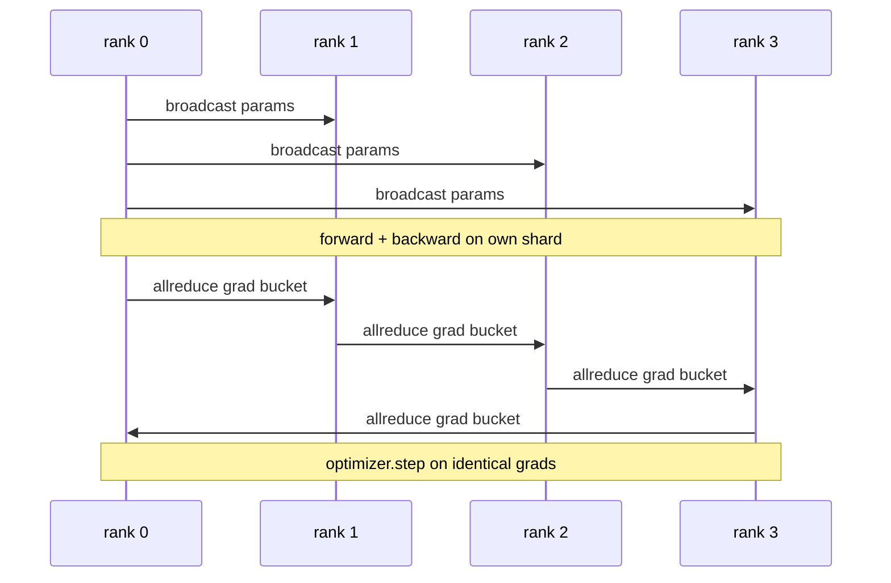

# Dados paralelas DDP a partir do zero

> DistribuídoDataParallel é um gancho no topo do allreduce. Envolver um modelo, transmitir os parâmetros iniciais a partir da classificação 0 para que cada classificação comece idêntica, instalar um gancho para trás em cada parâmetro que emite um allreduce do gradiente, e o resto é descida do gradiente.

**Type:** Build
**Languages:** Python
**Prerequisites:** Phase 19 Track C lessons 42-49
**Time:** ~90 min

## Objetivos de aprendizagem

- - O cabo a .`DistributedDataParallel`- envolvente em forma que transmita os parâmetros iniciais e reduz os gradientes após o retorno.
- Spawn N CPU está com `torch.multiprocessing.spawn`Sobre o fundo do mundo negro com um encontro baseado em arquivos.
- Demonstrar a correcção da sincronização gradiente através da formação do mesmo modelo nos mesmos dados sequencialmente e mostrando a equivalência de parâmetros por etapa.
- Defender o uso de baldes (fusão gradiente) e de sobreposição (comm durante o retorno) como as duas mudanças que transformam um DDP em funcionamento em um DDP de produção.

## O problema

Um modelo de 1 bilhão de parâmetros com 12 GB de ativações não cabe em uma GPU de consumo. Mesmo quando se encaixa, o treinamento leva semanas.

Sem sincronização de gradientes, as réplicas N divergem por passo 2. O modelo não é mais "um modelo treinado em mais dados", são N modelos separados que compartilham pesos iniciais. Com sincronização de gradientes mal feita (um allreduce por parâmetro, sem sobreposição, sem bucketing) a rede é o gargalo de engarrafamento e as GPUs estão à espera do fio. A nave do DDP está a fazer a sincronização de gradientes quase livre em relação à computação. O canônico PyTorch DDP consegue isso por gradientes de bucketing, sobrepondo todoreduce com a camada seguinte para trás, e usando NCCL em NVLink. Podemos fazer as três coisas com o CPU com o gloo e aprender as mesmas lições.

## O conceito



### As três operações necessárias para o DDP

| Stage | Collective | Why |
|-------|-----------|-----|
| Init | broadcast from rank 0 | Every rank starts with the same parameters |
| After backward | allreduce of each grad | The mean gradient is what the optimiser steps on |
| Sometimes | broadcast of buffers | Batchnorm running stats stay synchronised |

### Por que é mau e não sumário

Allreduce-SUM dividido por world_size dá a média de gradiente. A média é invariante para world_size: uma taxa de aprendizagem sintonizada em uma posição funciona em quatro filas porque a magnitude do gradiente por passo não muda. Allreduce-SUM sem a divisão obriga você a retunar a taxa de aprendizagem toda vez que você mudar o tamanho do cluster. DDP envolve a soma e divide; faça o mesmo na lição.

### Por que gradientes de balde

Um transformador tem milhares de tensores de parâmetros. Um allreduce por tensor paga o piso de latência de luz milhares de vezes. DDP agrupa gradientes em ~ 25 MB baldes e emite um allreduce por balde. Os mesmos bytes totais se movem através do fio, mas a latência é amortizada sobre o balde. Para o modelo pequeno da lição agrupamos tudo em um balde; a estrutura é o que transporta.

### Por que apertar a semente

Cada grau deve chamar`torch.manual_seed(seed + rank)`Para misturar , mas`torch.manual_seed(seed)`para o parâmetro init. Uma única semente compartilhada significa que cada rank vê a mesma ordem de lote (paralhelos de dados desfazidos); uma semente específica de rank para parâmetros significa que os parâmetros iniciais discordam por epsilon flutuante e a sincronização de gradiente não torna mais as réplicas idênticas.

```figure
ci-ddp-grad-sync
```

## Construí-lo

`code/main.py`Implementos:

- `MiniMLP`A MLP de 3 camadas é pequena o suficiente para convergir em segundos, grande o suficiente para expor o fio.
- `DistributedDataParallel(model, world_size)`: transmite parâmetros no momento da construção, retorna um envelope cujo `sync_grads`Divide os graduados acumulados todos reduzidos-sumados por tamanho mundial.
- `worker(rank, world_size, ...)`: ciclo de formação completo com `torch.distributed`Iniciar sobre o Glou, avançar, recuar, sincronizar, passo.
- `_reference_single_process_loop(...)`: exerce o mesmo modelo sobre os mesmos dados sequencialmente numa posição, utilizado pelo ensaio de equivalência de parâmetros em byte-equivalente após cada passo.

- É o que é ?

```bash
python3 code/main.py
```

Resultado: uma tabela de treinamento por etapa que compara a perda de um único processo e a soma de verificação de parâmetros com a corrida DDP em 4 fileiras.

## Padrões de produção em silêncio

Três padrões endurecem o DDP o suficiente para ser enviado.

**Find unused parameters.**Alguns caminhos para a frente ignoram os parâmetros condicionalmente (saída inicial, mistura de especialistas de roteador). Os parâmetros ignorados não têm gradiente, mas o gancho de DDP ainda os espera e reduz os impasses. `find_unused_parameters=True`O custo é um gráfico de caminhada por passo, então deixe-o fora a menos que seus ramos para a frente.

**Static graph optimisation.**Quando o avanço é estável através dos degraus,`static_graph=True`Otimizar é importante em escala: a pré-computação economiza alguns ms por passo, o que se compõe em 10.000 passos.

**Gradient accumulation needs care.**Acumular gradientes sobre microbatches K sem sincronizar cada microbatch é uma vitória de 10x de throughput.`no_sync()`Se esquecermos o gerente, reduzimos todos os K vezes para nada, e o rendimento cai para o chão.

## Usá-lo

Padrões de produção:

- **PyTorch DDP.**A aplicação canónica. `torch.nn.parallel.DistributedDataParallel(model)`fios em bucketing, sobreposição e o contexto no_sync.
- **HuggingFace Accelerate.**Adiciona um lançador que se ocupa .`torchrun`O mesmo DDP debaixo do capô.
- **Megatron-LM data parallel.**Combina DDP com tensor paralelo para modelos grandes; a peça paralela de dados é o mesmo padrão de redução total após retrocesso.

## Envia-o

A lição 78 (ZeRO sharding) substitui o parâmetro allreduce com reduce_scatter para que cada rank só armazene seu shard do estado de otimização.

## Exercícios

1. Adicione cubos de gradiente de tamanho configurável e mísse o aceleramento versus um redução total por parâmetro em um modelo mais profundo.
2. Implementação `no_sync()`como um gestor de contexto e verificar que a acumulação de gradientes corresponde a uma linha de base de processo único em relação aos microbatches K.
3. Adicionar um`find_unused_parameters`modo em que o avançado às vezes salta uma das camadas de MLP; sem a bandeira, a corrida deve ficar em estancamento.
4. Substitua o gloo por `torch.distributed.barrier()`-só sincronização para sentir a diferença entre sincronização baseada em redução total e sincronização baseada em barreira.
5. Meter a carga de sincronização de gradiente como uma fração do tempo de passagem para os tamanhos de lote 1, 16, 256 e explicar a escala.

## Termos-chave

| Term | What people say | What it actually means |
|------|----------------|------------------------|
| DDP | "Data parallel" | Wrapper that broadcasts params and allreduces grads each step |
| Bucket | "Fuse grads" | Group N small allreduces into one large one |
| Overlap | "Hide comm" | Issue allreduce while later layers still computing backward |
| no_sync | "Accumulate" | Skip the post-backward allreduce for gradient accumulation |
| find_unused | "Branchy forward" | Detect parameters with no grad before reducing |

## Mais leitura

- [PyTorch DistributedDataParallel docs](https://pytorch.org/docs/stable/generated/torch.nn.parallel.DistributedDataParallel.html)
- [PyTorch DDP internals tutorial](https://pytorch.org/tutorials/intermediate/ddp_tutorial.html)
- [Li et al, PyTorch Distributed: Experiences on Accelerating Data Parallel Training](https://arxiv.org/abs/2006.15704)
- Fase 19 Lição 76 - os coletivos DDP é construído sobre
- Fase 19 Lição 78 - A fragmentação ZeRO substitui o allreduce por parâmetro com o reduce_scatter
