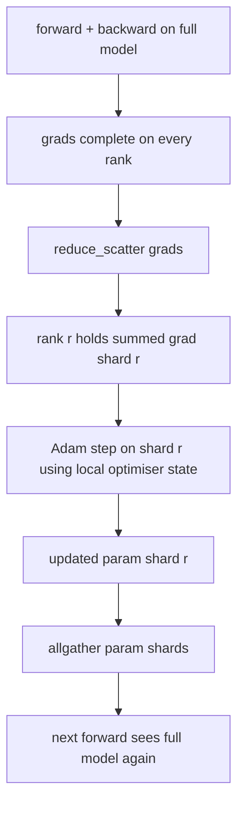

# Otimizador ZeRO Estado de fragmentação

> Adam armazena duas estimativas de momento por parâmetro, ambas em float32. Um modelo com parâmetro 7B carrega 56 GB de estado mais ótimo. O ZeRO estágio 1 desmembra que atravessa as fileiras N; cada fileira possui 1/N do optimizador. Após o passo local, os fragmentos de parâmetro atualizados são transmitidos de volta, cada rank reconstrui o modelo completo, e começa o próximo passo. A vitória é uma queda linear na memória da maior atribuição individual na pilha de treinamento.

**Type:** Build
**Languages:** Python
**Prerequisites:** Phase 19 Track C lessons 42-49
**Time:** ~90 min

## Objetivos de aprendizagem

- O estado de otimização de fragmentos (primeiro momento, segundo momento, fp32 cópia mestre) em N filas, de modo que cada fila possui 1/N.
- Use reduce_scatter para entregar cada rank apenas a soma de gradiente do seu fragmento, e depois todos para transmitir os fragmentos de parâmetro atualizados de volta.
- Calcule a tabela de armazenamento de memória para a fase 1, fase 2, fase 3 contra a DDP de baunilha.
- Defender a escolha da etapa 1 vs. etapa 2 vs. etapa 3 em relação ao tamanho do modelo e ao orçamento da largura de banda.

## O problema

O Vanilla DDP replica tudo: parâmetros, gradientes e estado de otimização estão presentes em toda a parte em cada classificação. Para um modelo de parâmetro 7B em fp16 que significa 14 GB de parâmetros, 14 GB de gradientes e 28 GB de estado de otimização por classificação. O estado de otimização é o maior termo e o mais fácil de desgastar porque só é tocado durante o passo, não durante a frente ou para trás.

O ZeRO estágio 1 reduz o estado de otimização. Cada fila contém 1/N dos momentos de Adão. Depois de recuar, em vez de reduzir o gradiente completo e pisar localmente, a ZeRO reduz_scatters para que cada rank receba apenas o gradiente somado de seu fragmento. A classificação aplica o passo mais óptimo ao seu fragmento dos parâmetros principais. Os parâmetros atualizados, então, todos se reúnem para que cada rank tenha o modelo completo para o próximo avanço. A memória mais óptima cai em N. O tráfego de fios por passo é o mesmo que o DDP: um redu_scatter mais um allgather é igual a um allreduce por largura de banda. A memória ganha, o volume mantém-se.

## O conceito



### Etapas do ZeRO

| Stage | What is sharded | Memory per rank | Comm per step |
|-------|----------------|------------------|---------------|
| DDP | nothing | params + grads + optim | 1x allreduce |
| ZeRO-1 | optimiser state | params + grads + optim/N | 1x reduce_scatter + 1x allgather |
| ZeRO-2 | optim + grads | params + grads/N + optim/N | 1x reduce_scatter + 1x allgather |
| ZeRO-3 | optim + grads + params | params/N + grads/N + optim/N | 1x allgather per layer + 1x reduce_scatter per layer |

O estágio 1 é a vitória mais barata porque o estado mais otimista domina o orçamento. O estágio 2 precisa de lógica de acumulação de gradiente-fragmento, mas a largura de banda é a mesma. O estágio 3 (FSDP) paga por camada de comunicação para cada avanço e para trás, obtendo a queda de memória de parâmetro-fragmento.

### A matemática da memória, números reais

Para um modelo com parâmetros P treinados com Adam em precisão mista:

| Term | Vanilla | ZeRO-1 | Why |
|------|---------|--------|-----|
| fp16 params | 2P bytes | 2P bytes | needed for forward |
| fp16 grads | 2P bytes | 2P bytes | needed for backward |
| fp32 master copy | 4P bytes | 4P/N bytes | only the optim uses it |
| fp32 first moment | 4P bytes | 4P/N bytes | only the optim uses it |
| fp32 second moment | 4P bytes | 4P/N bytes | only the optim uses it |
| Total | 16P bytes | 4P + 12P/N bytes |   |

A N=8: vanilla 16P, ZeRO-1 5,5P, uma queda de 65%. A N=64: vanilla 16P, ZeRO-1 4,19P, uma queda de 74%.

### Por que reduzir_dispersão batidas todosreduzir-depois-dispartilhar

Allreduce dá a cada grau o gradiente total sumado. Se só precisar de fragmentos r, o (N-1)/N do gradiente que foi reduzido é desperdiçado na classificação r. Reduce_scatter fornece exatamente o fragmento de cada rank possui; os bytes por rank são os mesmos que allreduce (uma vez que allreduce é reduce_scatter + allgather), mas a segunda metade é substituída pelo parâmetro-shard allgather mais tarde. O fio de rede é idêntico ao DDP, a memória é dividida.

```figure
cd-zero-shard
```

## Construí-lo

`code/main.py`Implementos:

- `flatten_params(module)`E ...`unflatten_into(module, flat)`O layout plano é o que faz da fragmentação por classificação uma simples fatia.
- `ZeroOptimizer(model, world_size, rank, lr)`que possui o fragmento de grau da cópia principal e dos momentos de Adam.
- `step()`que corre reduce_scatter no gradiente plano, aplica Adam ao fragmento da classificação, e reúne todos os parâmetros atualizados de volta.
- Uma demonstração que treina um MLP de 3 camadas por 20 passos e imprime o orçamento de memória por passo ao lado de uma linha de base de DDP de vaína.

- É o que é ?

```bash
python3 code/main.py
```

Saída: perda por passo e a tabela de memória que mostra ZeRO-1 mantém 1/N do estado de otimização em cada classificação versus a cópia completa do DDP.

## Padrões de produção em silêncio

Três padrões endurecem o ZeRO o suficiente para o enviar.

**Sharded checkpointing matters.**O estado de otimização do ZeRO-1 é dividido em filas; o checkpoint tem que registrar qual categoria possui o quê. A lição 80 constrói o manifesto de checkpoint fragmentado que retoma uma corrida do ZeRO no mesmo tamanho mundial. Sem ele o estado salvo é ilegível ao reiniciar.

**Mixed precision is the point.**A ZeRO é uma técnica de precisão mista; a cópia mestre fp32 é o que é fragmentado.

**Stage 1 is a near-free win.**A comunicação é idêntica ao DDP por largura de banda. As economias de memória são lineares em N. O único custo é a contabilidade para o shard optimizador. As pilhas de produção são padrão para a fase 1 a menos que a memória de parâmetro shard também seja um problema; em seguida, a etapa 2 ou 3 negocia comunicações para memória.

## Usá-lo

Padrões de produção:

- **DeepSpeed ZeRO.**A aplicação de referência. `deepspeed_config.json`seleciona o estágio 1/2/3 e os tamanhos da partição.
- **PyTorch FSDP.**O equivalente nativo PyTorch.`ShardingStrategy.SHARD_GRAD_OP`é ZeRO-2; `FULL_SHARD`É o ZeRO-3.
- **HuggingFace Accelerate.**Enrola tanto a DeepSpeed quanto o FSDP sob uma configuração uniforme.

## Envia-o

Lição 79 (paralelo de pipeline) é o eixo ortogonal de fragmentação: em vez de fragmentar o estado de otimização através do mesmo modelo, os fragmentos de pipeline se colocam em camadas.

## Exercícios

1. Estender-se até ZeRO-2 através de gradientes de fragmentação: cada grau só armazena o gradiente para o seu fragmento, alcançado por zerar a parte não fragmentada após o retrocesso.
2. Adicione um perfil de memória que imprima o uso real de byte fp32 na classificação 0 versus a previsão da fórmula.
3. Mita o tempo de parede por passo do DDP de vainilha versus o ZeRO-1 e decompõe em frente, para trás, comunicações.
4. Implementar o corte de gradiente sob o ZeRO-1: a norma L2 deve ser calculada em todos os fragmentos através de toda redução da norma local ao quadrado.
5. Implementar um "Zero ingênuo" com allreduce em vez de reduce_scatter, medir a diferença de tempo de fio. Defender a opção reduce_scatter com números.

## Termos-chave

| Term | What people say | What it actually means |
|------|----------------|------------------------|
| ZeRO-1 | "Shard the optimiser" | Each rank holds 1/N of fp32 master + Adam moments |
| ZeRO-2 | "Shard grads too" | Each rank also drops the non-shard gradients after reduce_scatter |
| ZeRO-3 | "Shard params" | Each rank holds 1/N of fp16 params; allgather per layer in forward |
| Master copy | "fp32 weights" | The high-precision parameter copy the optimiser updates |
| Reduce_scatter | "Split the sum" | Deliver each rank only its shard's summed gradient |

## Mais leitura

- [Rajbhandari et al, ZeRO: Memory Optimizations Toward Training Trillion Parameter Models](https://arxiv.org/abs/1910.02054)
- [DeepSpeed ZeRO documentation](https://www.deepspeed.ai/tutorials/zero/)
- [PyTorch FSDP documentation](https://pytorch.org/docs/stable/fsdp.html)
- Fase 19 Lição 76 - a redução e a coleção desta lição
- Fase 19 Lição 80 - ponto de controlo fragmentado que o Estado ZeRO deve usar
