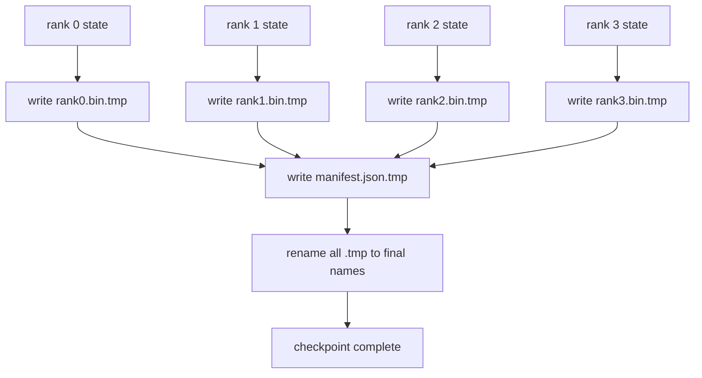

# Ponto de Controle e Resumo Atômico

> Um trabalho de treinamento de parâmetro 70B é interrompido por uma falha de nódulos a cada poucas horas. O formato do ponto de controlo decide se perder 30 minutos ou 30 horas. Um ponto de controlo fragmentado escreve o fragmento de cada grau em paralelo e registra a propriedade num manifesto. O Resume carrega o fragmento de cada rank de seu próprio arquivo, reconstrui o estado no mesmo tamanho mundial, e os passos mais otimistas como se nada tivesse acontecido. A escrita atômica mantém um ponto de controlo semelhante a um novo currículo.

**Type:** Build
**Languages:** Python
**Prerequisites:** Phase 19 Track C lessons 42-49
**Time:** ~90 min

## Objetivos de aprendizagem

- Salva um ponto de controlo de vários cargos como um ficheiro de fragmentos por cargos, mais um manifesto que registra qual cargos possui o quê.
- Use o padrão de escrita atômica (escrever para um caminho temporário e depois renomear) para que uma escrita de meia-crash nunca produz um ponto de controle meio concluído.
- Resumir a partir do manifesto, verificando o estado de igual-byte para ambos os parâmetros fp16 e o estado de otimização ZeRO em cada classificação.
- Defenda o esquema manifesto contra os três modos de falha: mudança de tamanho mundial, desajuste da contagem de fragmentos e escrita parcial.

## O problema

Um ponto de verificação de baunilha lê todos os parâmetros e o estado de otimização para o rank 0, reúne e escreve um único arquivo. Para um modelo 70B que é 1,1 TB de estado através da porta de rede de uma fila. Os escritores bloqueiam todas as outras fileiras porque estão à espera do encontro. A largura de banda IO é a ligação de rede mais lenta de uma única GPU, não o agregado. Em um cluster real, a fase de recolha-pós-escritura pode demorar mais do que a hora de formação anterior, o que significa que o trabalho é enviado em menos de um ponto de controlo por dia de formação.

Os pontos de controlo fragmentados invertam o padrão: cada rank escreve o seu próprio fragmento para o seu próprio arquivo em paralelo. Os registos manifestos que classificam a qual fragmento pertencia, assim, o currículo pode colocar cada fragmento de volta para onde veio. O agregado escreve escalas de largura de banda com o cluster. Um ponto de controlo de 1 TB que levou 4 horas a passar por uma fila leva 4 minutos a passar por 64 filas. Além disso, o manifesto dá-lhe um contrato para currículos incompatíveis: mudanças de tamanho mundial são detectáveis, escritos parciais são detectáveis, e o caminho de carga pode falhar em voz alta em vez de silenciosamente usando dados obsoletos.

## O conceito



### Esquema manifestado

```json
{
  "world_size": 4,
  "step": 1234,
  "wall_clock_seconds": 4521,
  "shards": [
    {"rank": 0, "path": "rank0.bin", "sha256": "...", "param_shard_offset": 0, "param_shard_numel": 65536},
    {"rank": 1, "path": "rank1.bin", "sha256": "...", "param_shard_offset": 65536, "param_shard_numel": 65536}
  ],
  "schema_version": 1
}
```

Três campos estão carregando.`world_size`faz um currículo de um tamanho diferente fracassar em vez de ser silenciosamente corrupto. `sha256`por fragmento pega partial ou corrompo escreve. `param_shard_offset`E ...`param_shard_numel`Per fragmento, deixe o carregador reconstruir o tensor de parâmetro plano na posição correta.

### Escrita atômica

O padrão padrão: escrever cada fragmento para `<name>.tmp`, escreva o manifesto para `manifest.json.tmp`O sistema de arquivos é completamente presente ou o antigo. Um crash antes do renome final deixa o ponto de verificação anterior como o vivo. Sem escrever atômico um crash pode deixar um fragmento parcial com um manifesto presente que aponta para ele, e a carga corrompe o estado de optimizador no currículo.

### Três modos de falha contra os quais o esquema deve se defender

| Failure | Symptom | Defence |
|---------|---------|---------|
| World-size change | resume on N=8 with manifest from N=4 | world_size mismatch in manifest, fail loudly |
| Shard count mismatch | resume sees fewer rank*.bin files than shards in manifest | enumerate shards, verify every one exists |
| Partial write | shard file truncated mid-flush | sha256 verification on load |

Cada defesa rejeita a má carga cedo; a alternativa é a corrupção silenciosa que surge 100 passos depois quando a perda vai para a NaN.

### Porquê arquivos por categoria, não um grande arquivo

Escrever simultâneo para um arquivo através de `O_APPEND`O sistema de arquivos por rank não tem nenhuma disputa e beneficia da striping quando o sistema de arquivos subjacente é paralelo (Lustre, GPFS). As pilhas de produção (DeepSpeed, FSDP, NeMo) usam todos arquivos por rank por essa razão.

```figure
ci-sharded-checkpoint
```

## Construí-lo

`code/main.py`Implementos:

- `ShardManifest`dataclass com o esquema acima mais `to_json`- Não .`from_json`- Não .
- `save_sharded(state_dict_per_rank, dir, step)`que escreve o estado binário de cada rank para o seu próprio arquivo usando o padrão atômico de tempo-então-renome, depois escreve o manifesto.
- `load_sharded(dir, expected_world_size)`que lê o manifesto, verifica o sha256 de cada fragmento e retorna os ditos de estado por rank.
- Um teste de ida e volta: construir estado por rank, salvar, carregar, afirmar byte-equal.

- É o que é ?

```bash
python3 code/main.py
```

Resultado: 4 arquivos de fragmentos mais manifesto escrito, depois recarregado com verificação igual a byte.

## Padrões de produção em silêncio

Três padrões endurecem o ponto de controlo o suficiente para enviar.

**Async write.**As pilhas de produção emitem o ponto de controle escrever em um fio ou processo separado para que o treinamento continue. A barreira está no próximo ponto de controle: não comece a próxima salvação até que a anterior seja completa.`async_io`A lição mantém a escrita sincrónica para que os passos sejam visíveis.

**Local fast disk first, then async upload.**Escreva para NVMe local (rápido) e depois substitua-se para S3 ou GCS. O padrão de duas camadas mantém o ponto de verificação no cluster rápido para o currículo enquanto envia uma cópia durável fora do cluster para o arquivo. O manifesto carrega o caminho local; um manifesto de upload carrega o caminho remoto.

**Rotation matters.**As corridas de produção mantêm os últimos pontos de controle K (geralmente 3-5) e rotam os mais antigos. Sem rotação o disco preenche a metade da corrida e o próximo ponto de controle falha. Com a rotação, o próximo save elimina o mais antigo primeiro, liberando o orçamento.

## Usá-lo

Padrões de produção:

- **DeepSpeed checkpointing.** `deepspeed.save_checkpoint(tag=step)`escreve arquivos por categoria e um `latest`Ficha apontando para a etiqueta ativa.
- **PyTorch FSDP checkpointing.** `torch.distributed.checkpoint`Salva estado fragmentado com um `Planner`que decide o layout por rank.
- **NeMo.**Enrola DeepSpeed e FSDP com um uniforme `save_to_checkpoint`API que adiciona metadados.

## Envia-o

A lição 81 salva um ponto de controlo fragmentado da execução de ponta a ponta do DDP+ZeRO e recarrega-o no mesmo tamanho mundial para provar a validade do contrato de currículo.

## Exercícios

1. Adicionar escrita async: iniciar a salvação em um thread e deixar o treinamento continuar. Bloquear a próxima salva até que a anterior seja concluída.
2. Adicionar um`last_5_steps`rotação: manter os 5 pontos de controlo mais recentes, excluir os mais antigos antes de guardar um novo.
3. Adicionar um caminho de verificação rápida com apenas CRC para a recarga de circuito interno (a rotação transforma um ponto de controlo em novo ponto ativo sem sha256 completo).
4. Adicione uma carga de tamanho transversal: reequilíbrio de fragmentos de N=4 para N=8 lendo o manifesto, concatenando e re-fragmentando.
5. Adicione um upload a um falso S3 (um segundo diretório) e escreva o manifesto de upload. Defenda a política de armazenamento de duas camadas.

## Termos-chave

| Term | What people say | What it actually means |
|------|----------------|------------------------|
| Sharded checkpoint | "Per-rank save" | Each rank writes its own shard file in parallel |
| Manifest | "Index" | JSON file recording shard paths, offsets, and sha256 |
| Atomic write | "tmp then rename" | Write to .tmp then POSIX rename so a crash leaves the previous file live |
| Partial write | "Truncated shard" | A crash during write produces a corrupt shard; sha256 catches it |
| Rotation | "Keep last K" | Delete oldest checkpoint before writing new one to bound disk usage |

## Mais leitura

- [DeepSpeed checkpointing](https://deepspeed.readthedocs.io/en/latest/model-checkpointing.html)
- [PyTorch torch.distributed.checkpoint](https://pytorch.org/docs/stable/distributed.checkpoint.html)
- [POSIX rename atomicity](https://pubs.opengroup.org/onlinepubs/9699919799/functions/rename.html)
- Fase 19 Lição 78 - o estado ZeRO este ponto de controlo é moldado para salvar
- Fase 19 Lição 81 - a demonstração de ponta a ponta faz viagens de ida e volta para o estado salvo
