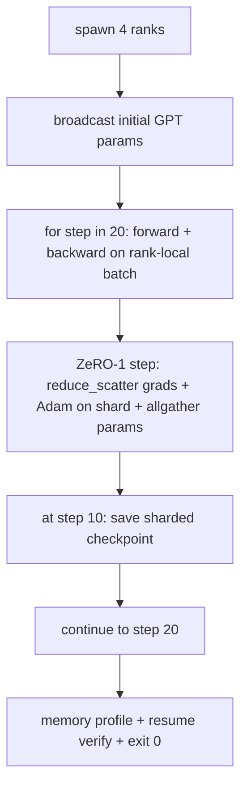

# Formação distribuída de ponta a ponta

> As lições 76 a 80 construíram cada uma uma peça. Esta é a montagem: um pequeno GPT treinado em 4 fileiras simuladas com DDP para sincronização de gradientes, ZeRO-1 para fragmentação de estado de otimização e um ponto de verificação fragmentado na marca de meio caminho. A demonstração executa 20 passos, termina-se, imprime uma curva de perda mais um perfil de memória e escreve um ponto de verificação reiniciável.

**Type:** Build
**Languages:** Python
**Prerequisites:** Phase 19 Track C lessons 42-49
**Time:** ~90 min

## Objetivos de aprendizagem

- Compõem o DDP (leção 77) mais o ZeRO-1 (leção 78) mais os pontos de controlo fragmentados (leção 80) em um único ciclo de treinamento.
- Treinar um modelo de linguagem transformador de 2 camadas em um pequeno corpo sintético por 20 passos em 4 fileiras simuladas.
- Imprima uma tabela de perdas por passo, um perfil de memória por rank e um manifesto de checkpoint que retoma em byte-equal no mesmo tamanho mundial.
- Defender a composição: cada peça é testável de forma independente em lições anteriores e esta lição prova que eles compõem.

## O problema

Uma pedra angular é a prova de que as peças se encaixam. Lição 76 Colectivos implementados. A lição 77 envolveu-os no DDP. Lição 78 estado de optimizador fragmentado com redu_scatter. Lição 79 analisa o gasoduto. A lição 80 salvou um ponto de controlo fragmentado. Cada lição estava sozinha com seu próprio teste. Uma corrida de treinamento real usa todos os primitivos de uma só vez; se a composição for errada, a perda diverge, o ponto de controle se recusa a retomar, ou a memória por rank cresce quando deve encolher.

Esta lição executa a demonstração de ponta a ponta e verifica quatro invariantes: (a) a perda diminui monotonicamente nos 20 passos dentro do ruído de flutuação, (b) cada nível mantém a mesma norma de parâmetro em cada passo, (c) a memória de otimização por nível é igual aos bytes da fórmula ZeRO-1 12P/N, e (d) o ponto de verificação no passo 10 recarrega byte-equivalente ao reiniciar. A demonstração termina-se: 20 passos, comando único, saída 0.

## O conceito



### O mini GPT

O modelo é pequeno a propósito: 2 blocos de transformador, incorporado dim 32, 4 cabeças de atenção, vocabulário 64, comprimento de sequência 16, lote 4. Alguns milhares de parâmetros. Grande o suficiente para exercer cada decisão de cablagem (a atenção multi-head corre o caminho mascarado padrão; LayerNorm tem pesos para sincronizar; a cabeça LM é uma projeção linear separada de volta ao vocabulário). Quase pequeno para 20 passos em 4 quadros de CPU terminar em segundos.

### As regras de composição

| Lesson piece | What it owns | What it leaves to the loop |
|--------------|--------------|----------------------------|
| DDP broadcast | Initial parameter sync | One call at construct time |
| ZeRO-1 step | Gradient sync, master copy update, parameter broadcast | One call per step replacing optimiser.step |
| Sharded checkpoint | Persist per-rank state, manifest with sha256 | Called on rank 0 with state collected via allgather |
| Training loop | Forward, backward, loss logging | Calls the three above in order |

O loop não conhece os arquivos reduce_scatter ou rendezvous. Os módulos ZeRO e checkpoint expõem interfaces estreitas que o loop compõe.

### Por que um pequeno GPT e não apenas um MLP

O MLP da lição 77 foi suficiente para verificar a sincronização dos gradientes. Um pequeno GPT adiciona três coisas: uma cabeça LM separada sobre a vocab (na aula, desligada para clareza; GPT completo normalmente liga a cabeça ao embedding do token), softmax + cross-entropy como a perda (mais casos de borda numérica do que MSE), e uma frente assimétrica (embeddings, em seguida, atenção, em seguida, MLP por camada). Se se apegar a um MLP para a pedra de captação, oculta se a composição lida corretamente com a forma de grad ou a forma de grad da camada de incorporação.

### Autoterminação significa saída 0

O circuito tem 20 passos fixos e sai.`while True`A pedra final que você pode deixar funcionando sem supervisão e encontrar um registro completo quando terminar é uma pedra final que prova que o sistema está conectado corretamente.

```figure
ci-distributed-assembly
```

## Construí-lo

`code/main.py`Implementos:

- `MiniGPT`: Transformador de duas camadas com auto-atenção mascarada e cabeça LM separada.
- `make_corpus(seed, total_tokens)`: dados deterministas de previsão do próximo token.
- `_train_worker`: gerado por rank; transmite parâmetros init, executa o ciclo, chama o passo ZeRO, escreve o ponto de controlo fragmentado no passo 10.
- `verify_resume`: após a execução principal, recarrega o ponto de verificação passo 10 no processo e afirma que os fragmentos principais salvos correspondem à instantânea em memória byte-for-byte.
- `main`O projeto de verificação é o seguinte:

- É o que é ?

```bash
python3 code/main.py
```

Resultado: uma tabela de perda de 20 filas, um perfil de memória de 4 filas por rank, um manifesto de checkpoint e uma linha "RESUMAR VERIFIADO" sobre o sucesso.

## Padrões de produção em silêncio

Três padrões terminam a composição para corridas reais.

**Checkpoint every K minutes, not every K steps.**O tempo de passagem varia com o comprimento do sequência e o número de microbatches. Uma cadência de 10 minutos de checkpoint capta o mesmo cálculo independentemente do tamanho do modelo.

**Detect divergence early.**As corridas de produção adicionam um guardador NaN após o retrocesso e um detector de pico de perda; se a perda salta mais de 2x em um passo, volte para o checkpoint anterior em vez de deixar o optimista avançar para um estado degenerado.

**Aggregate the memory profile across ranks.**A memória por rank varia por rank em corridas reais (o rank com o maior estágio de pipeline detém mais ativações).

## Usá-lo

Padrões de produção:

- **DeepSpeed.**Combina DDP + ZeRO + pipeline + controlpointing de ativação sob uma configuração.
- **PyTorch FSDP.**O equivalente nativo.`FullyShardedDataParallel`com`ShardingStrategy.SHARD_GRAD_OP`É o ZeRO-2.
- **NeMo and Megatron-LM.**Adicione paralelo tensor para os modelos muito maiores; caso contrário, a composição é a mesma forma.

## Envia-o

A pista completa termina aqui. As 6 lições juntas são o subsistema de treinamento distribuído que uma equipe real construiria antes de adotar DeepSpeed; a abstração foi comprovada contra o gloo e os modos de falha foram exercidos.

## Exercícios

1. Adicionar uma divisão tensor-paralhel da cabeça de atenção e verificar que a perda corresponde à linha de base de um único rank.
2. Adicionar a acumulação de gradientes em 4 microbatches e provar que o gradiente é igual ao gradiente de um grande lote.
3. Adicione um currículo do passo 10 que realmente continua o treinamento para o passo 20 e produz a mesma perda final que a corrida original.
4. Adicione uma métrica de exportação (perda, norma de graduação, tempo de passagem) para o JSONL para que a execução possa ser visualizada após o fato.
5. Adicione um guardão NaN que volte ao ponto de controle anterior em um pico de perda e force um pico com um multiplicador LR de um passo para exercer o rollback.

## Termos-chave

| Term | What people say | What it actually means |
|------|----------------|------------------------|
| End-to-end | "Wire it all up" | One run composes every piece, not a unit test per piece |
| Memory profile | "GB per rank" | Bytes held on each rank for params, grads, optimiser state |
| Resume contract | "Save and load" | Per-rank state byte-equal after a checkpoint round-trip |
| Self-terminating | "Bounded run" | Fixed step count, exit 0 on completion, no human in the loop |

## Mais leitura

- [DeepSpeed end-to-end training tutorial](https://www.deepspeed.ai/getting-started/)
- [PyTorch FSDP advanced tutorial](https://pytorch.org/tutorials/intermediate/FSDP_advanced_tutorial.html)
- [Megatron-LM training script reference](https://github.com/NVIDIA/Megatron-LM)
- Fase 19 Lições 76-80 - cada peça esta lição compõe
- Fase 17 - transferência da composição para um aglomerado real
