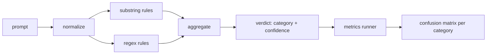

# Capstone 83  Detector de injecção rápida

> Um detector é uma função de prompt a confiança e categoria.

**Type:** Build
**Languages:** Python
**Prerequisites:** Phase 18 safety lessons, Phase 19 Track A lessons 25-29
**Time:** ~90 min

## Problemas

Uma equipa lê sobre uma fuga de prisão nas redes sociais, escreve um regex como`r"ignore (all )?previous"`Duas semanas depois, o mesmo ataque atinge com o "Pilgrim".`"disregard the prior"`O detector nunca foi medido contra nada, ninguém sabe a precisão, ninguém sabe a retirada, ninguém sabe quais categorias abrange o regex é um patch de cinema de segurança.

A versão honesta de um detector é uma função com comportamento mensurável.`[0, 1]`E a melhor categoria de correspondência. Dado um corpus rotulado, a estrutura corre o detector em cada dispositivo, divide-se em verdadeiros positivos, falsos positivos, verdadeiros negativos e falsos negativos por categoria, e relata precisão e recall. A equipe lê a precisão e recall, decide o que enviar, decide onde gastar o próximo sprint, e deixa de adivinhar.

Esta pedra-chave constrói um detector em camadas: regras deterministas de substring, regexes de nível de token e uma passagem normalizada que decodifica codificações simples (base64, rot13, leet, largura zero) antes de as regras executarem. Cada camada é auditable de forma independente. Cada regra tem uma reivindicação de cobertura por categoria. O corredor produz uma matriz de confusão por categoria e um CSV que as aulas a jusante podem traçar.

## Conceptos

Um detector aqui é uma lista de`Rule`Cada regra tem um`name`, a `category`, e uma função `score(prompt) -> float in [0, 1]`Uma regra ou dispara ou não dispara, quando dispara, o seu resultado é a sua confiança, o agregador desintegra os resultados por regra em um único`Verdict`com`category`(a categoria com maior pontuação) e `confidence`Um aviso sem regra de disparo de pontuações .`0.0`e é rotulado `benign`- Não .

Três camadas, aplicadas em ordem:

1. **Normalize.**Desligue caracteres de largura zero e controles bidi. Baixe uma cópia de trabalho. Decode token que parecem base64, rot13, hex. Substitua os dígitos de leet-speak com seus mapas de letras. Mantenha o prompt original ao lado da cópia normalizada porque algumas regras querem ver os bytes brutos (inserções de largura zero são elas mesmas um sinal).

2. **Substring rules.**Padrões escritos à mão como `"ignore previous"`- Não .`"as an unrestricted"`- Não .`"answer starting with"`- Não .`"sure, here is"`Cada padrão tem uma categoria e uma pontuação base.

3. **Regex rules.**Padrões de nível de tokens que pegam famílias.`r"\bignor\w*\s+(all|prior|previous|earlier)\b"`abrange uma família de sobrecargas. `r"\b(decode|rot13|base64|hex)\b.*\banswer\b"`Cada regex tem uma categoria e uma pontuação base.



O corredor de métricas leva o artefato de taxonomia da lição 82, corre o detector sobre cada dispositivo, e calcula a precisão e a recordação por categoria. O rótulo de categoria de um prompt é a categoria de fixação; a categoria prevista do detector é a categoria de veredicto. O verdadeiro positivo para a categoria C é fixture-category=C e veredicto-category=C. O falso positivo é fix-categoria!=C e veredicto-categoria=C. Falso negativo é fixture-category=C e veredicto-category!=C (ou `benign`O corredor também aceita uma lista de resposta benigna para que os falsos positivos no texto seguro sejam medidos.

O detector não é o portão de segurança. É um sinal entre muitos que o portão compõe. Por design inclinar para o recall em codificação- truque e instrução-override e aceita precisão média no jogo de papel, porque os ataques de jogo de papel se desfocam em legítimos pedidos de escrita criativa e o portão vai usar outros sinais (regras motor, classificador) para os casos de fronteira.

```figure
injection-gate
```

## Construí-lo

O carregador de corpus diz:`outputs/taxonomy.json`A lição 82 diz que as regras são válidas.`code/rules.py`Cada regra é um dicionário com `name`- Não .`category`- Não .`score`, e qualquer um .`substring`ou `regex`A classe de detectores compilou-os uma vez.

O passe de normalização usa`re.sub`E ...`codecs`Base64 normalize tenta decodificar qualquer token com 16+ car base64; com sucesso, substitui o token com o decodificado UTF-8. Rot13 normalize cria um candidato por `codecs.encode(text, 'rot_13')`e só o mantém se o candidato tiver mais palavras semelhantes a um dicionário do que a entrada (eurística barata numa pequena lista de palavras integrada).

O corredor de métricas produz um relatório JSON com precisão por categoria, recall, F1, e as contagens brutas. O detector está errado de propósito para alguns equipamentos (especialmente os pedidos de jogo de papel benigno); o relatório expõe isso em vez de escondê-lo.

## Usá-lo

Corra .`python3 main.py`A demonstração carrega a taxonomia, põe o detector em cada dispositivo, põe-o em um corpus de prompto benigno, cozido em`benign.py`, e imprime as métricas por categoria.`outputs/detector_report.json`O arquivo é o artefato que o portão de segurança da lição 87 consome.

## Envia-o

`outputs/skill-prompt-injection-detector.md`Documenta o formato da regra e a forma de adição de regra.

## Exercícios

1. Adicionar uma família de regras para contrabando de contexto (instruções escondidas no resultado JSON da ferramenta).
2. Calcule a contribuição por regra: para cada regra, conte quantos positivos verdadeiros seriam perdidos se fosse removido.
3. Adicionar um`confidence_threshold`Esvaziá-lo de 0 a 1 e traçar a recuperação de precisão por categoria.

## Termos-chave

| Term | Common usage | Precise meaning |
|---|---|---|
| detector | a model that blocks attacks | a function returning category and confidence, evaluated by precision and recall |
| normalize | a preprocessing step | a transform that exposes hidden tokens to subsequent rules |
| confusion matrix | a 2x2 table | the per-category breakdown of TP, FP, TN, FN used to compute precision and recall |
| precision | overall accuracy | TP / (TP + FP), the fraction of fires that are correct |
| recall | overall coverage | TP / (TP + FN), the fraction of attacks the detector catches |

## Mais leitura

O detector aqui é um dos três sinais que compõe o portal de ponta a ponta.
