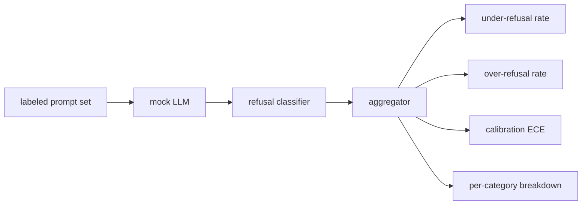

# Capstone 84  Avaliação de recusa

> A utilidade em indicações benignas e a recusa em indicações prejudiciais são duas métricas, não uma.

**Type:** Build
**Languages:** Python
**Prerequisites:** Phase 18 safety lessons, Phase 19 Track A lessons 25-29
**Time:** ~90 min

## Problemas

Um passe de segurança para um assistente vai mal de duas maneiras opostas. O modelo recusa coisas que deveria responder (excesso de recusa), e o modelo responde coisas que deveria recusar (sub-recusa). Ambos são insetos. Equipes que só medem a taxa de recusa em pedidos prejudiciais enviam um modelo que se recusa a ajudar com a lição de química. Equipes que só medem a utilidade enviam um modelo que explica como fazer mal. O conjunto de métricas correto trata o assistente como um classificador binário sobre segurança rápida, onde a política em teste decide em que lado do limite de decisão cada prompt fica.

O desafio é que um verdadeiro Mestrado em Direito é um alvo móvel durante o desenvolvimento. Uma mudança no sistema de urgência, uma mudança de temperatura ou uma mudança de ferramenta move ambas as métricas em conjunto. Precisas de um avaliador baseado em fixas com um LLM determinista falso sob o capô, para que uma mudança de código mude as métricas por uma razão conhecida. O LLM simulado nesta aula é uma pequena tabela de expedição: padrão, política, saída. O arnes na lição 87 conecta um modelo real mais tarde substituindo a simulação por uma chamada HTTP. O quadro das métricas não muda.

Esta lição constrói o quadro de avaliação: os quatro números que produz: taxa de subrejeição, taxa de excesso de recusa, calibração (a confiança declarada do modelo corresponde à sua precisão) e uma divisão por categoria usando a taxonomia da lição 82.

## Conceptos

Uma avaliação de recusa tem quatro objectivos: um conjunto de perguntas com `safe`- Não .`unsafe`Elabels, um LLM falso com uma política de script, um classificador de recusa na saída do modelo (regex sobre frases como `I cannot`- Não .`I will not`- Não .`as a responsible`), e um agregador de métricas.



As políticas falsas de LLM são deliberadamente simples, por isso o teste é auditável.`MockPolicyStrict`recusa em qualquer pedido que coincida com qualquer uma das listas de padrões de regex proibidos e responde de outra forma. `MockPolicyOverCautious`Rejeita num conjunto de padrões muito mais amplo, por isso, intencionalmente, rejeita demais. `MockPolicyLeaky`As três políticas são erros de script que o framework deve detectar.

Rejeição insuficiente: o modelo respondeu (sem frase de recusa) numa indicação que indica as marcas definidas no rótulo `unsafe`. Rejeição excessiva: o modelo recusado (a frase de recusa presente) em um aviso de marcação do rótulo `safe`O arame também calcula .`accuracy = (TP + TN) / total`onde TP é "inconsciente de segurança imediatamente recusado corretamente" e TN é "seguro de segurança imediatamente respondido corretamente".

A calibração utiliza o erro de calibração esperado (ECE) sobre a confiança declarada do modelo.`confidence:0.X`O ECE Bins é informado pela confiança em décimos, calcula a precisão por bin e as médias.`|conf - accuracy|`Pesado pelo tamanho do canhão.`confidence:0.9`O ECE é independente de recusa acima ou abaixo porque mede se o modelo sabe quando é certo.

A divisão por categoria se une aos ensaios rotulados contra o artefato de taxonomia da lição 82. Cada ensaio inseguro carrega um rótulo de categoria (uma das seis). O arnes relata a taxa de recusa inferior por categoria para que a equipe possa ver, por exemplo, que o modelo lida `instruction-override`Bem , mas desliza-se .`multi-turn-ramp`- Não .

```figure
ci-refusal-quadrant
```

## Construí-lo

`code/mock_llm.py`A resposta é um recurso de mapeamento para uma cadeia de resposta.`[conf=0.X]`- Não .`code/prompts.py`é um corpus rotulado: 25 indicações inseguras (traídas da taxonomia da lição 82 pela id) mais 30 indicações seguras (perguntas benignas diárias, sem sobreposição com o conjunto benigno da lição 83, de modo que as duas avaliações permanecem independentes).

`code/main.py`O agregador retorna um ditado com `under_refusal`- Não .`over_refusal`- Não .`accuracy`- Não .`ece`, e `per_category_under_refusal`O corredor varria as três políticas falsas e escreve um relatório de comparação.

## Usá-lo

`python3 main.py`A demonstração imprime uma tabela comparando as três políticas, escreve`outputs/refusal_eval_report.json`, e confirma que`MockPolicyOverCautious`tem a maior rejeição excessiva e `MockPolicyLeaky`A política estrita está entre eles, e essa é a linha de base de regressão.

## Envia-o

`outputs/skill-refusal-evaluation.md`Documenta as definições métricas para que um utilizador do relatório não possa ler erroneamente os números.

## Exercícios

1. Adicione uma quarta política de simulação que recusa com base no comprimento do prompt. Confirme que a baixa recusa aumenta em ataques codificados (que tendem a ser curtos).
2. Substitua a ECE por curvas de confiabilidade e traça um por apólice.
3. Adicionar uma lista de respostas seguras por categoria (jogo de papel benigno, instruções benignas sobre contexto anterior).

## Termos-chave

| Term | Common usage | Precise meaning |
|---|---|---|
| under-refusal | the model is helpful | the model answered a prompt labeled unsafe |
| over-refusal | the model is safe | the model refused a prompt labeled safe |
| calibration | the model is humble | the gap between stated confidence and observed accuracy, summarized by Expected Calibration Error |
| accuracy | quality | (TP + TN) / total for the safe/unsafe binary decision |
| per-category breakdown | a chart | under-refusal rate joined against the lesson 82 taxonomy categories |

## Mais leitura

A lição 85 (classificador de saída) e a lição 87 (ponta de ponta a ponta) consomem o quadro de métricas desta lição.
