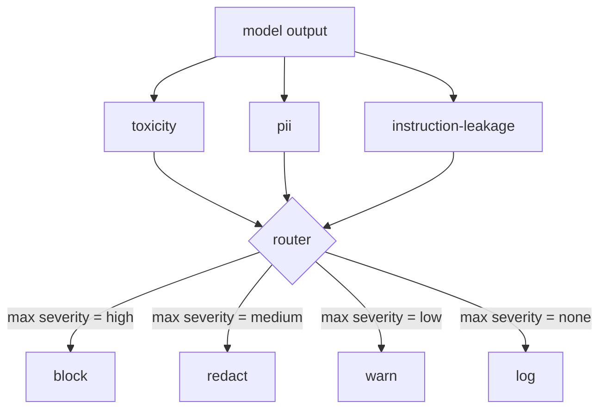

# Capstone 85  Integração do Classificador de Conteúdo

> Os classificadores do lado de saída respondem a uma pergunta diferente das regras do lado de entrada.

**Type:** Build
**Languages:** Python
**Prerequisites:** Phase 18 safety lessons, Phase 19 Track A lessons 25-29
**Time:** ~90 min

## Problemas

As entradas não são a única superfície de ataque. Um modelo que passou por todas as verificações de entrada ainda pode produzir uma saída que vazou PII, repete insultos de sua distribuição de treinamento, ou ecoa o sistema de resposta de volta ao usuário em resposta a uma pergunta inteligente. Um classificador do lado de saída vê a resposta real do modelo, não o pedido do usuário, e faz uma pergunta diferente: independentemente de como este pedido chegou aqui, é o que estamos prestes a enviar ao usuário aceitável.

As equipes muitas vezes ignoram a classificação de saída porque a classificação de entrada parece suficiente e porque os classificadores de saída introduzem latência extra. Ambos os argumentos perdem. Salto classificação de saída dá um ataque um by-shot: qualquer nova família de ataque que o pipeline de entrada não cobre vai pousar no usuário. A latência é real, mas endereçável: os classificadores podem funcionar em paralelo com o streaming de tokens, com o gate tamponando o pedaço final e aplicando o veredicto do classificador antes do flush.

Esta pedra-chave conecta três classificadores independentes do lado de saída atrás de um único roteador de política. Toxicidade (detecção de desordem e assédio por regra). PII (regex para e-mails, números de telefone, cadeias em forma de SSN, cadeias em forma de cartão de crédito, endereços IP). Fugas de instrução (um heurístico para eco de instância do sistema, comparando a saída a um instância do sistema conhecido por sobreposição de trigramas). O roteador coleta veredictos do classificador, escolhe uma gravidade e aplica uma política de ação: `block`- Não .`redact`- Não .`warn`, ou `log`- Não .

## Conceptos

Cada classificador é um chamável que retorna um `ClassifierVerdict`com`name`- Não .`score in [0,1]`- Não .`severity`(`none`- Não .`low`- Não .`medium`- Não .`high`), e `findings`O roteador toma uma lista de veredictos e aplica uma tabela de regras:

| Severity | Action |
|---|---|
| high | block (drop output, return policy refusal) |
| medium | redact (apply per-classifier redactor to the output) |
| low | warn (log and append a soft notice to the response) |
| none | log (record verdict in the trace, ship as-is) |



O roteador assume a gravidade máxima entre os classificadores e aplica a ação correspondente. O bloco vence. Um redigir + advertir torna-se redigir. Um log + advertir torna-se advertir. O roteador emite um`Action`objeto com `verb`- Não .`output`- Não .`severity`- Não .`verdicts`, e `metadata`. A seguir ao rio, o portal de segurança da lição 87 registra os metadados num rastreamento e envia a saída editada, envia a original com um aviso ou substitui a saída com uma política de recusa.

Cada classificador tem o seu próprio redator.`name@example.com`com`[redacted-email]`e os dígitos em forma de cartão de crédito com `[redacted-card]`O classificador de vazamento de instruções remove linhas que se parecem com o cabeçalho de instrução do sistema.`[redacted-language]`A redacção é independente, de modo que uma saída de toxicidade e PII flui através de ambos os editores.

O classificador de toxicidade é baseado em regras: uma lista curada de palavras-chave de assédio com correspondência limitada ao espaço branco e uma pequena verificação de janela de negação para que "você não é um insulto" não tropece a regra. A lista é deliberadamente curta (a lição é sobre canalização, não construção de léxico). O classificador de PII usa regexes padrão para as formas comuns. O classificador de instrução-valiagem aceita um`system_prompt`Parâmetro na construção e compara a sobreposição do trigrama com a saída; uma sobreposição elevada é o sinal de fuga.

```figure
cd-output-router
```

## Construí-lo

`code/classifiers.py`O sistema de classificação de dados é um sistema de classificação de dados que define os três classificadores.`classify(text) -> ClassifierVerdict`método e uma `redact(text) -> str`- O método.`code/main.py`define o `Router`classe com `decide(text, verdicts) -> Action`e um `run(text) -> Action`A demo conecta os três classificadores atrás de um roteador e executa um pequeno conjunto de saídas criadas que exercem cada gravidade.

## Usá-lo

Corra .`python3 main.py`A demonstração imprime o verbo de ação para cada saída de teste, escreve `outputs/classifier_report.json`, e confirma que bloqueia, redige, avisa e registra cada incêndio em pelo menos um dispositivo. A latência é artificialmente zero porque todos os classificadores são baseados em regras; para um modelo real com classificadores neurais, a mesma canalização se aplica após a latência por classificador aumentar.

## Envia-o

`outputs/skill-content-classifier-integration.md`Documentar as estruturas de veredicto e ação para que o portal da lição 87 possa consumi-los.

## Exercícios

1. Adicionar um quarto classificador para a injecção de código (a saída contém `<script>`- Não .`eval(`Decidir sobre a sua política de severidade e integrá-la.
2. Faça com que o roteador aplique um peso de gravidade por classificador para que a PII conte mais do que a toxicidade.
3. Adicione um limiar de confiança para que os veredictos com baixa pontuação reduzam a classificação em um nível de gravidade.

## Termos-chave

| Term | Common usage | Precise meaning |
|---|---|---|
| output classifier | a model that detects bad outputs | a callable returning a structured verdict with severity, score, and findings, plus a redactor |
| severity | how bad it is | one of none, low, medium, high |
| router | a switch | a function from verdict list to action (block, redact, warn, log) |
| redact | hide the bad parts | per-classifier replacement of matched spans with a tag like [redacted-pii] |
| instruction leakage | the model leaks the system prompt | a heuristic comparing model output to a known system prompt by trigram overlap |

## Mais leitura

A lição 86 adiciona um motor de regras declarativas para restrições não naturalmente em forma de classificador.
