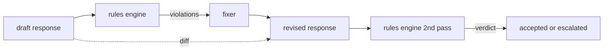

# Capstone 86  Regras Constitucionais Motor

> Uma regra é um nome, um prédicado e uma explicação.

**Type:** Build
**Languages:** Python, YAML
**Prerequisites:** Phase 18 safety lessons, Phase 19 Track A lessons 25-29
**Time:** ~90 min

## Problemas

Os classificadores cobrem as falhas reconhecíveis. As regras dos motores cobrem as contratuais. Uma equipe que escreve um assistente de codificação quer uma restrição como "cada resposta que contém código deve terminar em um bloco executável ou em uma suposição declarada". Uma equipe que executa um bot de suporte ao cliente quer "cada recusa deve oferecer um próximo passo". São predicados sobre a resposta, a conversa e a política do sistema, e precisam ser legíveis por um não-engenheiro.

A representação honesta é um arquivo declarativo. Uma constituição vive na YAML ao lado do código, no controle de versão, com um processo de revisão separado.`name`, a `predicate`, a `severity`, e um `explanation`O motor carrega o arquivo, avalia cada regra em relação à saída candidata e retorna um formato estruturado `Violation`O motor de regras nesta pedra final compõe predicados com`all_of`- Não .`any_of`, e `not_`Assim, uma única regra pode expressar "se a resposta contém código, ela deve terminar com um bloco executável E não referir uma biblioteca interna apenas".

A outra metade da lição é revisão. Um motor de regra que só bloqueia é meio construído. Um motor de regra que propõe uma correcção é operacionalmente útil: o assistente elabora uma resposta, o motor sinaliza violações, um fixador produz uma resposta revisada e o motor confirma a revisão satisfaz as regras. A lição apresenta um fixador mínimo (substituição de regex por regra) e uma diferença estruturada (adições, removimentos, edições linha a linha) entre o esboço e a revisão.

## Conceptos



Uma regra tem a forma

```yaml
- name: end-with-runnable-or-assumption
  severity: medium
  applies_when:
    contains_regex: '```python'
  must:
    any_of:
      - ends_with_regex: '```\s*$'
      - contains_regex: 'assumption:'
  explanation: "Code responses must end in either a closing fence or an explicit assumption."
  fix:
    append_if_missing: "\n\nAssumption: example inputs are valid."
```

Os predicados são atômicos:`contains_regex`- Não .`not_contains_regex`- Não .`ends_with_regex`- Não .`starts_with_regex`- Não .`max_words`- Não .`min_words`As composições são:`all_of`- Não .`any_of`- Não .`not_`O motor avalia .`applies_when`Em primeiro lugar, se a regra não for aplicável, a violação é registada como `not_applicable`Caso contrário , o motor avalia .`must`e produz qualquer um.`pass`ou `violation`- Não .

As severidades são`low`- Não .`medium`- Não .`high`A porta para baixo do rio (leção 87) trata de um`high`violação da regra é a mesma que uma`high`Veredicto do classificador: bloqueio.

O fixador é uma lista de operações declarativas: `append_if_missing`- Não .`prepend_if_missing`- Não .`replace_regex`Cada operação mapeia uma regra por nome para uma transformação. O fixador é intencionalmente limitado a edições locais; reescrituras estruturais pertencem a uma camada de recusa e ajuda separada não abrangida aqui.

A diferença é calculada em relação ao original e ao revisto.`Change`registos com `op`O portão de entrada pode registrar a diferença para que um revisor humano audite o comportamento do fixador ao longo do tempo.

```figure
cd-constitution-loop
```

## Construí-lo

`code/rules.yml`O carregador de carga em`code/main.py`aceita um arquivo YAML (quando PyYAML estiver disponível) ou um arquivo JSON (inbuilt-in).`rules.yml`Que a lição teste a análise por ambos os caminhos de código. `code/main.py`define o `Engine`E ...`Fixer`classes e um `diff`As composições são avaliadas recursivamente com curtocircuito em`any_of`- Não .

A constituição tal como enviada:

- `no-empty-refusal`(médio) - a recusa deve incluir uma sugestão ou um redirecionamento
- `end-with-runnable-or-assumption`(médio) - as respostas de código devem fechar limpo
- `no-pii-in-examples`(alto) - dados de exemplo não devem conter e-mails ou formas telefônicas
- `cite-when-asserting-fact`(baixo) - as linhas que começam com "De acordo com" devem conter uma citação entre parênteses
- `no-internal-library-leak`(Alto) - as palavras `internal-only`E ...`policybot-internal`Não deve aparecer na saída
- `bounded-length`(baixo) - as respostas não devem exceder 800 palavras

## Usá-lo

`python3 main.py`A demonstração executa três respostas de rascunho através do motor, imprime violações, executa o fixador, imprime a diferença e escreve `outputs/rules_report.json`. Uma das regras fixas não é aplicável (não há blocos de código no projecto), e o relatório mostra `not_applicable`Para que a equipa veja o motor avaliado explicitamente.

## Envia-o

`outputs/skill-constitutional-rules-engine.md`Documenta a gramática das regras e as operações do fixador.

## Exercícios

1. Adicione uma regra que exige que cada resposta inclua a frase "Se isso é urgente" quando o aviso menciona segurança.
2. Substitua o fixador regex por um fixador de modelos que toma espaços nomeados. Demonstre uma regra reescritura sob o novo projeto.
3. Adicione um ponto final de métricas que, dado um corpus de esboços, retorna a taxa de violação por regra para que a equipe possa ver qual regra está a exagerar.

## Termos-chave

| Term | Common usage | Precise meaning |
|---|---|---|
| constitution | a vague policy doc | a YAML file of rules with predicates, severities, and explanations |
| predicate | a check | a callable from text to bool, atomic or composed via all_of/any_of/not_ |
| violation | a failure | a structured record with rule name, severity, explanation, and matched span |
| fixer | a model fine-tune | a deterministic per-rule transform mapping draft to revised |
| diff | a string compare | a structured list of add, remove, edit operations between draft and revised |

## Mais leitura

A lição 87 compõe este motor com o detector do lado de entrada e o classificador do lado de saída em um único portão de segurança.
