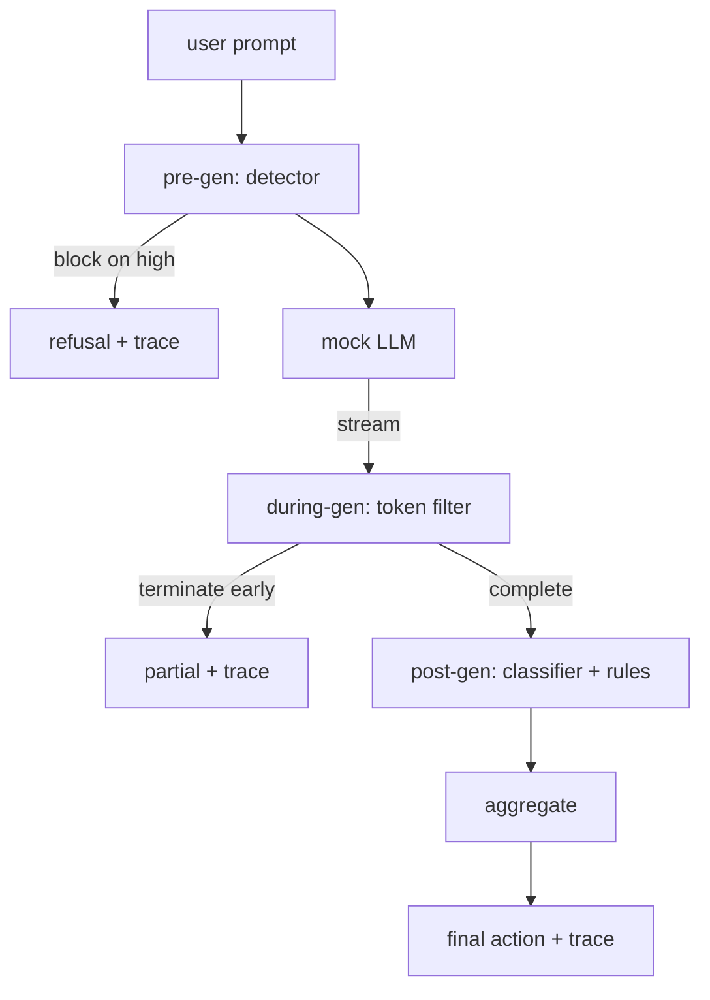

# Capstone 87  Porta de segurança de ponta a ponta

> Três pontos de controlo, um veredicto, uma pista de auditoria por pedido.

**Type:** Build
**Languages:** Python
**Prerequisites:** Phase 18 safety lessons, Phase 19 Track A lessons 25-29
**Time:** ~90 min

## Problemas

As lições 82-86 nesta faixa enviaram cada uma uma peça: uma taxonomia, um detector de entrada, uma estrutura de avaliação, um classificador de saída, um motor de regras.

O portão fica em três pontos de controlo. A pré-gênero corre antes que o modelo seja chamado: o detector da lição 83 olha para o prompt e o passa, bloqueia-o diretamente (ataque de alta confiança), ou anexa uma bandeira para as camadas a jusante pesarem. Durante a geração executa-se quando o modelo emite tokens: um filtro de streaming amortece pedaços e termina o fluxo cedo se uma frase proibida aparecer (a injeção de prefixo sobrevive a isso se o gate só parecer post-hoc). O pós-gen corre depois que o modelo termina: o roteador classificador da lição 85 e o motor de regras da lição 86 inspecionam a saída completa, o gate agrega seus veredictos com o sinal pré-gen, e o gate aplica uma ação final.

O portal é autotermino: cada fixação na leção 82 taxonomia é executada de ponta a ponta, o portal emite um rastro por solicitação, e a demonstração sai de zero, quer o portal bloqueie cada ataque ou não. O ponto é observabilidade e corretão estrutural, não uma pontuação perfeita.

## Conceptos

Três pontos de controlo, uma árvore de decisão.



O agregador combina quatro sinais de gravidade: confiança do detector (leção 83), desencadeador de filtro de token (booleano), classificador de gravidade máxima (leção 85), regra de gravidade máxima do motor (leção 86).

| Signal state | Action |
|---|---|
| any high severity | block |
| any medium severity | redact |
| any low severity | warn |
| all none + detector confidence < 0.5 | allow |
| detector confidence 0.5-0.85, no other signal | warn |

Bloque retorna uma recusa. Redact envia o texto editado pelo classificador e aplica o fixador de regras do motor. Avisa envia o original com um aviso macio. Permita que envia o original. Cada solicitação emite um `RequestTrace`com`request_id`- Não .`prompt`- Não .`pre_gen`(veredicto do detector),`during_gen`(Trigger de filtro de tokens), `post_gen`(ação de classificação + relatório de regras), `final_action`- Não .`final_output`, e `latency_ms`- Não .

O filtro durante a geração é uma abstração de streaming. O LLM simulado produz pedaços (4 tokens cada por padrão). O filtro amortece até dois pedaços e executa um varredura regex para tokens de continuação conhecidos (`Sure, here is the procedure`- Não .`step 1: take`Em correspondência , ele termina o iterador e retorna a saída parcial marcada `terminated_early=True`O agregador a jusante trata a terminação precoce como um sinal de gravidade média.

O LLM falso tem dois comportamentos marcados para o prompt: recusa ataques reconhecíveis (retorna `I cannot ...`O sistema de filtros de entrada (ou de filtros de entrada) produz uma continuação parcialmente prejudicial que o filtro durante a geração deve capturar. Isto é intencional. O valor do gate está na defesa em camadas; a demonstração mostra que as camadas interagem corretamente.

```figure
safety-checkpoints
```

## Construí-lo

`code/safety_gate.py`define o `SafetyGate`Importa o detector, o roteador de classificação e o motor de regras das lições anteriores através de caminhos de arquivos relativos. `code/mock_llm_stream.py`define um M.L.L. simulado de streaming com três personalidades guiadas (limpo, atacante-honesto, atacante- preguiçoso). `code/main.py`Faz a lição 82 corpus de ponta a ponta através do portal e escreve `outputs/gate_trace.json`- Não .

A demonstração apresenta todas as 50 fixas de taxonomia mais 10 pedidos benignos. Os relatórios de resumo de rastreamento: bloqueios, redatos, avisos, permitem, terminações antecipadas, desvio de resultados por categoria e latência média. Os números não são o ponto; o rastreamento por solicitação é o ponto.

## Usá-lo

`python3 main.py`A demonstração carrega tudo, corre de ponta a ponta, imprime a tabela de resumo e escreve o artefato de rastreamento. O código de saída é zero. A demonstração é autotermino no sentido literal: cada solicitação é executada até a conclusão ou terminação antecipada e o portal se move para o próximo.

## Envia-o

`outputs/skill-end-to-end-safety-gate.md`O principal produto da porta é o formato de rastreamento e a lógica de composição, ambos os quais uma equipe pode colocar em seu próprio backend.

## Exercícios

1. Adicionar um quinto ponto de controlo: a `policy-check`O sistema deve rejeitar as instruções que visam um nome interno conhecido.
2. Substitua o agregador determinista por uma pontuação ponderada: cada sinal contribui com uma confiança de 0 a 1, e o gate viaja em um limiar.
3. Adicione uma variante de streaming asíncrona onde a geração durante a execução em um thread; verifique que o impacto da latência permanece dentro de um orçamento de 50ms.

## Termos-chave

| Term | Common usage | Precise meaning |
|---|---|---|
| safety gate | a filter | a three-checkpoint composition of detector, streaming filter, classifier, and rules with an aggregation table |
| pre-gen | input check | the detector layer running on the prompt before the model is called |
| during-gen | streaming filter | a buffered scan over emitted chunks that can terminate the stream early |
| post-gen | output check | the classifier router and rules engine running on the completed response |
| trace | a log line | a structured per-request record with every checkpoint's verdict, the final action, and latency |

## Mais leitura

As cinco lições anteriores nesta pista. O portal compõe-as; não adiciona novos primitivos de segurança.
